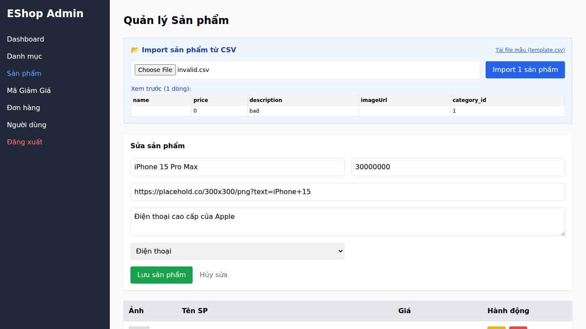

## Found by Test Case
GUI-045

## Requirement liên quan
SRS FR-16 + GUI_Testing validation

## Severity / Priority
Major / P1

## Environment
Chrome, Web Admin URL `http://localhost:5174/`, Backend URL `http://localhost:3000`, thực thi theo checklist GUI.

## Steps to reproduce
1. Đăng nhập Web Admin bằng tài khoản admin hợp lệ.
2. Đi tới Product Management / Sản phẩm.
3. Mở section CSV import.
4. Chọn file CSV có dòng thiếu `name` hoặc có `price` bằng 0/không dương.
5. Quan sát preview và thông báo lỗi trước khi import.

## Expected result
Khi CSV có dòng thiếu `name` hoặc `price` không dương, giao diện hiển thị lỗi theo dòng và lý do lỗi đủ rõ.

## Actual result
CSV có `name` rỗng và `price` bằng 0 vẫn được preview thành 1 dòng. UI không hiển thị lỗi theo dòng hoặc lý do lỗi rõ ràng trước khi import.

## Evidence
- Screenshot: 
- Checklist row: `GUI-045`
