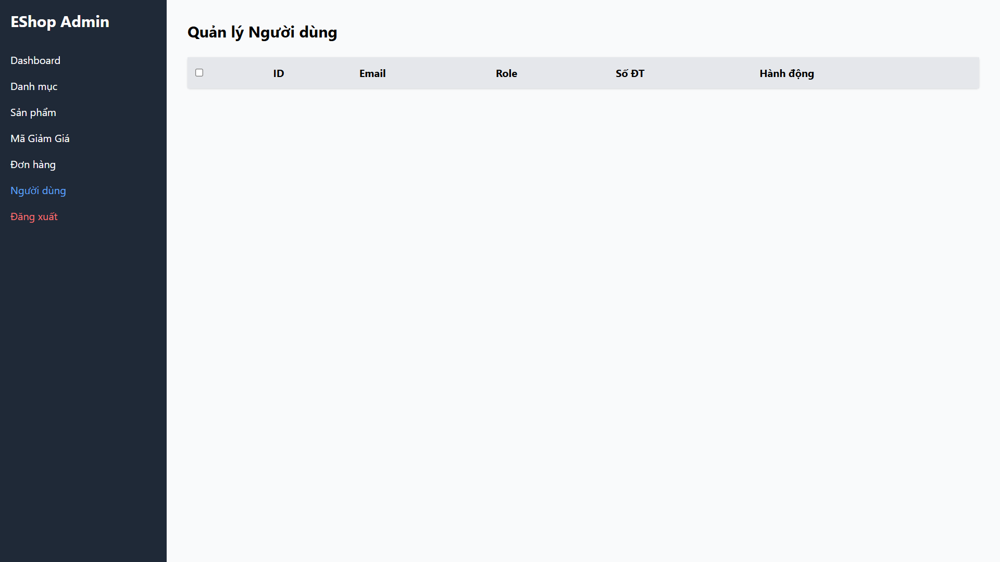

## Found by Test Case
GUI-054

## Requirement liên quan
GUI_Testing state-based + Usability heuristic

## Severity / Priority
Major / P2

## Environment
Chromium headless, Web Admin URL `http://localhost:5174/`, Backend URL `http://localhost:3000`, thực thi theo checklist GUI.

## Steps to reproduce
1. Đăng nhập Web Admin bằng tài khoản admin hợp lệ.
2. Đi tới User Management / Người dùng.
3. Chuẩn bị hoặc quan sát trạng thái danh sách người dùng rỗng hoặc không tải được.
4. Quan sát vùng danh sách người dùng và hướng xử lý được hiển thị.

## Expected result
Khi danh sách người dùng rỗng hoặc không tải được, giao diện hiển thị empty/error state thân thiện và có hướng xử lý.

## Actual result
Không thấy empty/error state rõ ràng khi danh sách người dùng rỗng hoặc không tải được. UI không cung cấp thông báo dễ hiểu hoặc hướng xử lý cho admin.

## Evidence
- Screenshot: 
- Checklist row: `GUI-054`
