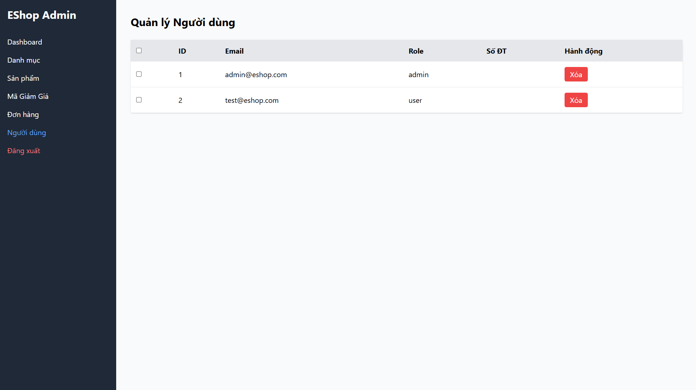
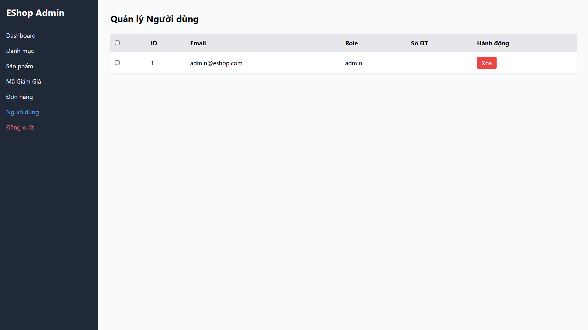

## Found by Test Case
GUI-055

## Requirement liên quan
SRS FR-19 + GUI_Testing risk-based

## Severity / Priority
Major / P1

## Environment
Chromium headless, Web Admin URL `http://localhost:5174/`, Backend URL `http://localhost:3000`, thực thi theo checklist GUI.

## Steps to reproduce
1. Đăng nhập Web Admin bằng tài khoản admin hợp lệ.
2. Đi tới User Management / Người dùng.
3. Bấm thao tác Xóa trên một người dùng.
4. Quan sát UI có yêu cầu xác nhận trước khi xóa hay không.

## Expected result
Khi admin bấm xóa người dùng, giao diện yêu cầu confirmation dialog trước khi thực hiện thao tác nguy hiểm.

## Actual result
Thao tác xóa người dùng không hiển thị confirmation dialog trước khi thực hiện hành động nguy hiểm.

## Evidence
- Screenshot: 
- Screenshot: 
- Checklist row: `GUI-055`
