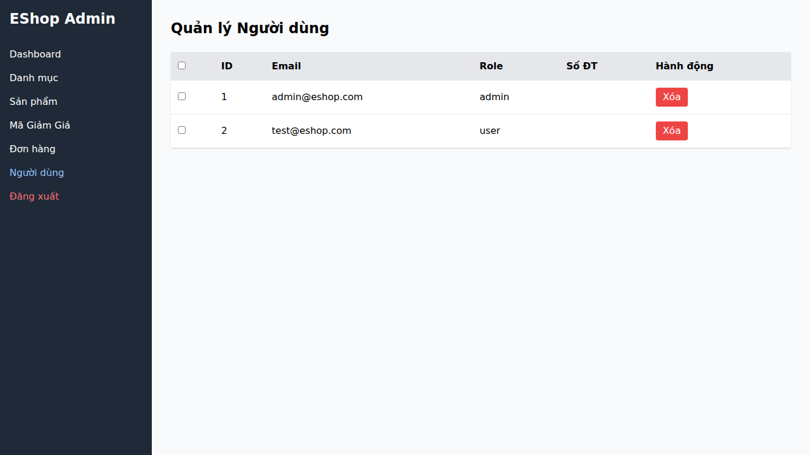

## Found by Test Case
GUI-056

## Requirement liên quan
SRS FR-19 + GUI_Testing validation

## Severity / Priority
Critical / P0

## Environment
Chrome, Web Admin URL `http://localhost:5174/`, Backend URL `http://localhost:3000`, thực thi theo checklist GUI.

## Steps to reproduce
1. Đăng nhập Web Admin bằng tài khoản admin hợp lệ.
2. Đi tới User Management / Người dùng.
3. Tìm dòng tài khoản admin đang đăng nhập.
4. Quan sát trạng thái hành động Xóa trên dòng tài khoản này.

## Expected result
Giao diện ngăn hoặc cảnh báo rõ khi admin cố xóa chính tài khoản đang đăng nhập.

## Actual result
Hàng tài khoản admin đang đăng nhập vẫn có hành động Xóa. UI không ngăn hoặc cảnh báo rõ ràng về rủi ro tự xóa tài khoản đang sử dụng.

## Evidence
- Screenshot: 
- Checklist row: `GUI-056`
