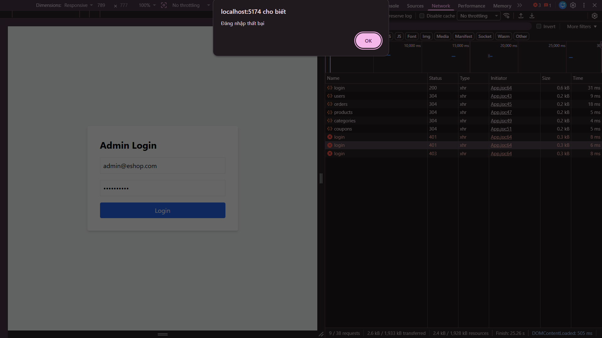

## Found by Test Case
HR-GUI-001

## Requirement liên quan
SRS FR-02 + GUI_Testing state-based

## Severity / Priority
Major / P1

## Environment
Chromium headless, Web Admin URL `http://localhost:5174/`, Backend URL `http://localhost:3000`, thực thi theo checklist GUI và phần Human Review Additions.

## Steps to reproduce
1. Mở trang Admin Login tại `http://localhost:5174/`.
2. Nhập sai thông tin đăng nhập 3 lần liên tiếp.
3. Quan sát thông báo và trạng thái form đăng nhập sau lần sai thứ ba.
4. Thử tiếp tục đăng nhập trong khoảng thời gian khóa dự kiến.

## Expected result
Sau 3 lần đăng nhập sai liên tiếp, giao diện hiển thị thông báo tài khoản bị khóa trong 30 giây và không cho phép tiếp tục đăng nhập cho đến khi hết thời gian khóa.

## Actual result
Sau 3 lần đăng nhập sai không thấy thông báo tài khoản bị khóa 30 giây rõ ràng. UI không thể hiện trạng thái khóa hoặc thời gian còn lại một cách quan sát được.

## Evidence
- Screenshot: 
- Checklist row: `HR-GUI-001`
