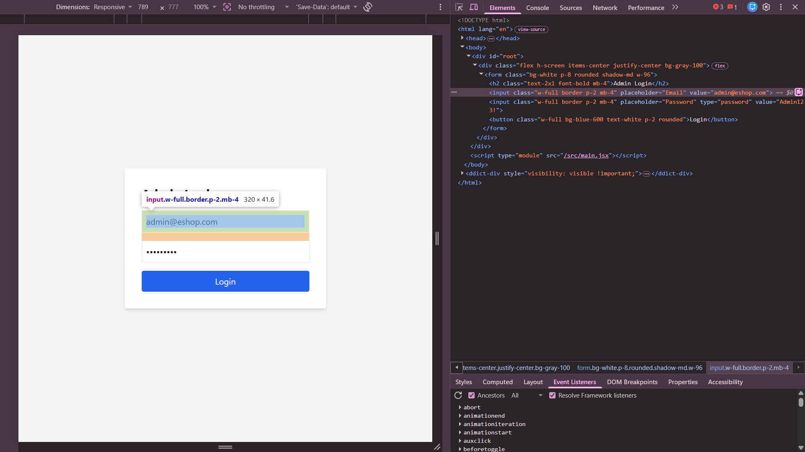

## Found by Test Case
HR-GUI-002

## Requirement liên quan
SRS GUI-02 + FR-02

## Severity / Priority
Major / P1

## Environment
Chrome, Web Admin URL `http://localhost:5174/`, Backend URL `http://localhost:3000`, thực thi theo checklist GUI và phần Human Review Additions.

## Steps to reproduce
1. Mở trang Admin Login tại `http://localhost:5174/`.
2. Kiểm tra trường Email trên form đăng nhập.
3. Quan sát type của input Email trong rendered DOM.

## Expected result
Trường Email sử dụng HTML5 `type="email"` để hỗ trợ kiểm tra định dạng email ngay trên trình duyệt.

## Actual result
Input Email không có `type="email"`, nên browser không hỗ trợ native email validation đúng như yêu cầu.

## Evidence
- Screenshot: 
- Checklist row: `HR-GUI-002`
