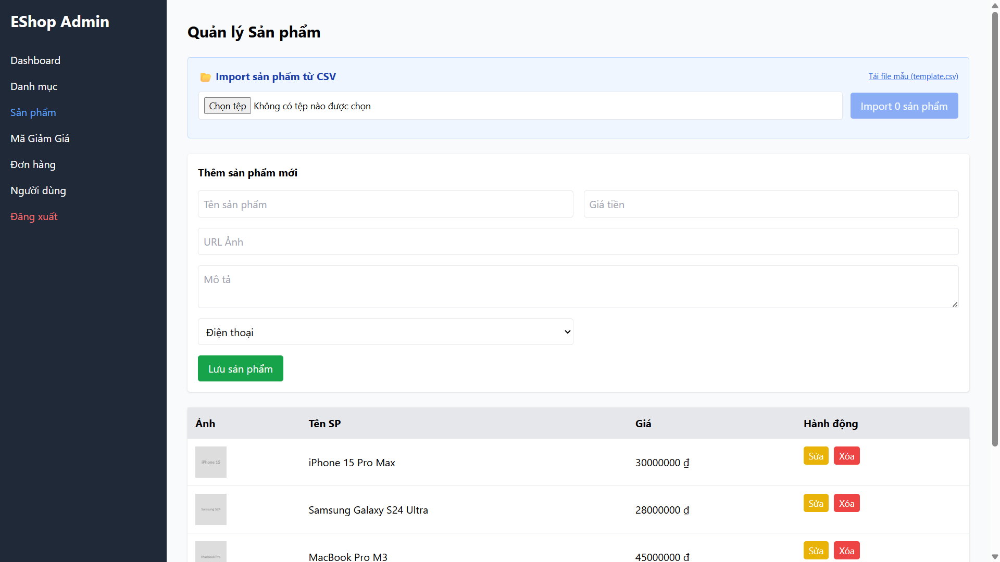

## Found by Test Case
HR-GUI-003

## Requirement liên quan
SRS GUI-01

## Severity / Priority
Minor / P2

## Environment
Chromium headless, Web Admin URL `http://localhost:5174/`, Backend URL `http://localhost:3000`, thực thi theo checklist GUI và phần Human Review Additions.

## Steps to reproduce
1. Đăng nhập Web Admin bằng tài khoản admin hợp lệ.
2. Quan sát các màn hình admin có nút hành động tích cực như Save, Add, Submit, Import.
3. Quan sát các nút thao tác nguy hiểm như Delete hoặc Remove.
4. So sánh màu nút với quy chuẩn consistency trong GUI Standards.

## Expected result
Các nút hành động tích cực (Save, Add, Submit, Import...) sử dụng màu xanh dương nhất quán; các nút thao tác nguy hiểm (Delete, Remove...) sử dụng màu đỏ nhất quán trên toàn bộ giao diện.

## Actual result
Nút `Lưu sản phẩm` là nút hành động tích cực nhưng dùng màu xanh lá. Các nút tích cực chưa thống nhất màu xanh dương như yêu cầu GUI-01.

## Evidence
- Screenshot: 
- Checklist row: `HR-GUI-003`
