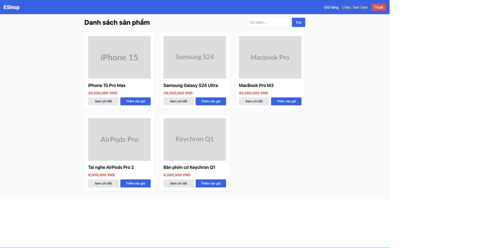

# BUG-IA01-PRODUCTDETAIL-001: Nút "Thêm vào giỏ hàng" ở trang chi tiết sản phẩm dùng màu xanh lá thay vì xanh dương

## Found by Test Case
GUI-004

## Requirement liên quan
FR-21 (Tiêu chuẩn Giao diện Chung — "nút hành động tích cực dùng màu xanh dương")

## Severity / Priority
Minor / P3

## Environment
**Browser/Device**: Chrome (desktop, qua Claude for Chrome), viewport 1539×784
**OS**: macOS
**URL**: http://localhost:5173/product/1 (và toàn bộ /product/:id khác)
**Build/commit**: eshop-sut @ 85af3ba

## Steps to reproduce
1. Vào trang chủ http://localhost:5173/ — quan sát nút "Thêm vào giỏ" trên các thẻ sản phẩm trong lưới: nút có màu xanh dương (`bg-blue-600`).
2. Bấm "Xem chi tiết" bất kỳ sản phẩm nào để vào trang Product Detail.
3. Quan sát nút "Thêm vào giỏ hàng" trên trang chi tiết.

## Expected result
Theo FR-21, nút hành động tích cực (submit/mua hàng) phải dùng màu xanh dương, nhất quán với nút cùng chức năng ở trang danh sách sản phẩm.

## Actual result
Nút "Thêm vào giỏ hàng" trên trang chi tiết sản phẩm dùng class `bg-green-600` (màu xanh lá), khác màu với chính nút "Thêm vào giỏ" cùng chức năng ở trang danh sách (`bg-blue-600`) — vừa vi phạm FR-21, vừa không nhất quán trong cùng một hệ thống. Xác nhận qua source `frontend-web/src/pages/ProductDetail.jsx` dòng 66.

## Evidence

## GitHub Issue
https://github.com/lmchkhi/CS423-CSC15003-Testing-N08/issues/94
