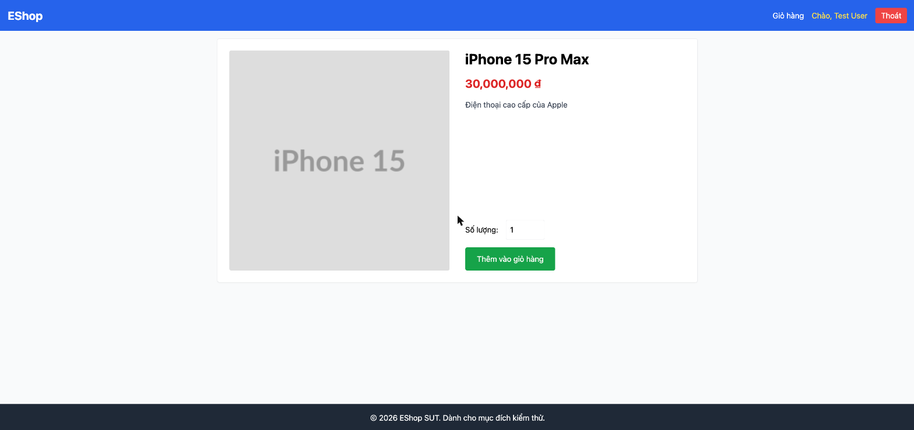

# BUG-IA01-PRODUCTDETAIL-002: Trang chi tiết sản phẩm không hiển thị trường "Danh mục"

## Found by Test Case
GUI-005

## Requirement liên quan
FR-06 (Xem chi tiết sản phẩm: "Hiển thị đầy đủ: Ảnh lớn, Tên, Giá, Mô tả, Danh mục")

## Severity / Priority
Major / P2

## Environment
**Browser/Device**: Chrome (desktop)
**OS**: macOS
**URL**: http://localhost:5173/product/1 .. /product/5 (toàn bộ 5 sản phẩm)
**Build/commit**: eshop-sut @ 85af3ba

## Steps to reproduce
1. Vào lần lượt các trang http://localhost:5173/product/1 đến /product/5.
2. Quan sát toàn bộ nội dung hiển thị: ảnh, tên, giá, mô tả, ô số lượng, nút thêm vào giỏ.
3. Gọi trực tiếp API `GET http://localhost:3000/api/products` để xác nhận backend có trả về trường `category_id` cho mỗi sản phẩm.

## Expected result
FR-06 yêu cầu trang chi tiết hiển thị đầy đủ Ảnh lớn, Tên, Giá, Mô tả, **Danh mục**.

## Actual result
Không có sản phẩm nào trong 5 sản phẩm hiển thị tên danh mục trên trang chi tiết, mặc dù API `GET /api/products` xác nhận backend đã có sẵn trường `category_id` cho mọi sản phẩm (`iPhone 15 Pro Max`: category_id=1, `MacBook Pro M3`: category_id=2, v.v.), dữ liệu tồn tại ở tầng API nhưng trang chi tiết chỉ hiển thị Tên, Giá, Mô tả, hoàn toàn thiếu Danh mục.

## Evidence

## GitHub Issue
https://github.com/lmchkhi/CS423-CSC15003-Testing-N08/issues/95
