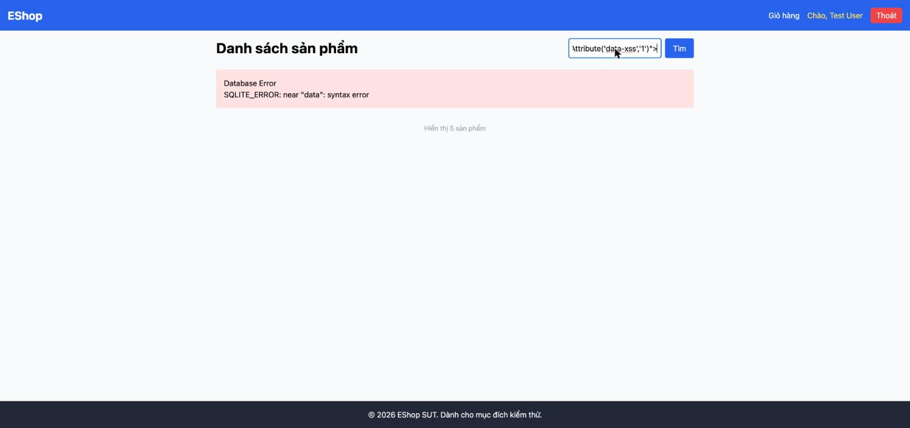

# BUG-IA02-HOMEPAGE-002: Reflected XSS qua từ khóa tìm kiếm và thông báo lỗi server (dangerouslySetInnerHTML không escape)

## Found by Test Case
GUI-060, GUI-064

## Requirement liên quan
FR-05 (Từ khóa tìm kiếm phải được hiển thị an toàn — không render HTML); SEC-04 (Mọi dữ liệu từ user nhập vào khi hiển thị trên UI phải được escape đúng cách, không dùng `innerHTML` trực tiếp)

## Severity / Priority
Critical / P0

## Environment
**Browser/Device**: Chrome (desktop, qua Claude for Chrome)
**OS**: macOS
**URL**: http://localhost:5173/
**Build/commit**: eshop-sut @ 85af3ba

## Steps to reproduce
1. Mở trang chủ, gõ vào ô tìm kiếm: `` rồi bấm Tìm (hoặc Enter).
2. Quan sát: một icon ảnh vỡ (broken image) thực sự xuất hiện ngay dưới dòng "Kết quả tìm kiếm cho:" — không phải văn bản thô của payload.
3. Chạy `window.__xss_fired` trên console → trả về `true`, xác nhận đoạn JavaScript trong `onerror` đã thực thi thành công.
4. Xác nhận qua source `frontend-web/src/pages/Home.jsx` dòng 64: `` — từ khóa tìm kiếm được render thẳng bằng `dangerouslySetInnerHTML`, không escape.
5. Tương tự, dòng 69-72: khi backend trả lỗi dạng chuỗi HTML (`errorHtml`), frontend cũng render bằng `dangerouslySetInnerHTML` — nếu nội dung lỗi từ backend có thể bị ảnh hưởng bởi input người dùng (xem BUG-IA02-HOMEPAGE-003), đây là một vector XSS thứ hai (lỗi hiển thị lỗi).

## Expected result
Từ khóa tìm kiếm do người dùng nhập phải được hiển thị dưới dạng văn bản thuần (escape HTML), không bao giờ được thực thi như mã HTML/JavaScript, theo đúng FR-05 và SEC-04.

## Actual result
Bất kỳ HTML/JavaScript nào nhập vào ô tìm kiếm đều được render và thực thi trực tiếp trên trang — một kẻ tấn công có thể dùng URL dạng `http://localhost:5173/?...` kèm payload trong tham số tìm kiếm được chia sẻ cho nạn nhân để đánh cắp session/cookie hoặc thực hiện hành động thay mặt nạn nhân (classic reflected XSS).

## Evidence

