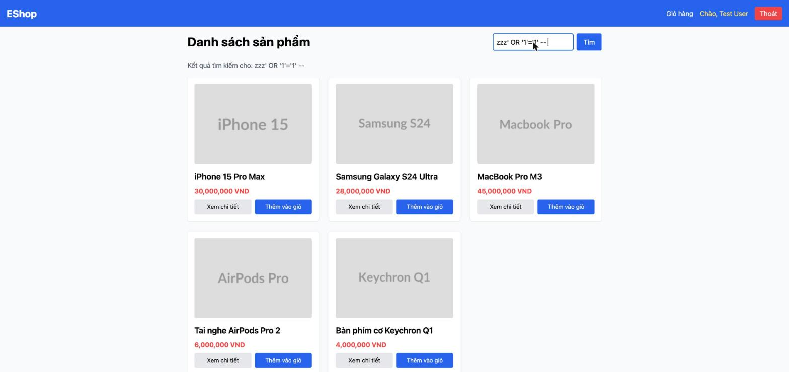

# BUG-IA02-HOMEPAGE-003: SQL Injection trong API tìm kiếm sản phẩm (backend, không dùng Parameterized Query)

## Found by Test Case
GUI-060, GUI-064 (phát hiện trong lúc kiểm thử an toàn hiển thị từ khóa tìm kiếm — vượt ngoài phạm vi item gốc, phát hiện thêm lỗ hổng backend)

## Requirement liên quan
SEC-05 (Truy vấn CSDL phải dùng Parameterized Query, không nối chuỗi trực tiếp); FR-05

## Severity / Priority
Critical / P0

## Environment
**Browser/Device**: Chrome (desktop, qua Claude for Chrome) — lỗ hổng nằm ở backend, không phụ thuộc trình duyệt
**OS**: macOS
**URL**: http://localhost:5173/ (frontend) → http://localhost:3000/api/products?search=... (backend API bị khai thác)
**Build/commit**: eshop-sut @ 85af3ba

## Steps to reproduce
1. Mở trang chủ, gõ vào ô tìm kiếm: `` rồi Tìm — server trả về HTTP 500 với nội dung `Database Error: SQLITE_ERROR: near "data": syntax error` (dấu `"` trong payload làm vỡ cú pháp SQL và rò rỉ thông báo lỗi CSDL thô ra ngoài — dấu hiệu kinh điển của SQL Injection).
2. Xác nhận khai thác thật: gõ `zzz' OR '1'='1' -- ` (một chuỗi không khớp tên sản phẩm nào) rồi Tìm — kết quả trả về **toàn bộ 5 sản phẩm** thay vì 0 sản phẩm, chứng minh điều kiện `WHERE` đã bị bỏ qua hoàn toàn qua injection.
3. Xác nhận qua source `backend/server.js` dòng 142-149:
   ```js
   app.get("/api/products", (req, res) => {
     const searchQuery = req.query.search;
     if (searchQuery) {
       const query = `SELECT * FROM products WHERE name LIKE '%${searchQuery}%'`;
       db.all(query, [], (err, rows) => {
         if (err) return res.status(500).send(`<h1>Database Error</h1><p>${err.message}</p>`);
   ```
   — chuỗi tìm kiếm được nối trực tiếp vào câu SQL bằng template literal, không qua tham số hóa (`?` + mảng params) như endpoint `/api/products/:id` ở ngay bên dưới (dòng 158, dùng đúng cách: `"SELECT * FROM products WHERE id = ?", [req.params.id]`).
4. Thông báo lỗi CSDL thô (`err.message`) cũng bị nối thẳng vào một chuỗi HTML trả về client — vừa rò rỉ thông tin nội bộ (tên engine, cấu trúc lỗi), vừa là input cho lỗ hổng XSS thứ hai ở frontend (xem BUG-IA02-HOMEPAGE-002).

## Expected result
Mọi truy vấn CSDL phải dùng parameterized query (SEC-05) — ví dụ `db.all("SELECT * FROM products WHERE name LIKE ?", [`%${searchQuery}%`], ...)`. Thông báo lỗi trả về client không được chứa chi tiết lỗi CSDL thô.

## Actual result
Endpoint `GET /api/products?search=` xây câu SQL bằng nối chuỗi trực tiếp, cho phép SQL Injection đầy đủ (đã chứng minh bypass điều kiện WHERE thành công). Về lý thuyết, kẻ tấn công có thể mở rộng thành UNION-based injection để đọc dữ liệu từ các bảng khác trong CSDL (ví dụ bảng `users` — xem SEC-01 về việc lưu mật khẩu), không chỉ giới hạn ở bảng `products`. Đây là lỗ hổng bảo mật nghiêm trọng nhất phát hiện được trong toàn bộ đợt kiểm thử GUI checklist.

## Evidence

