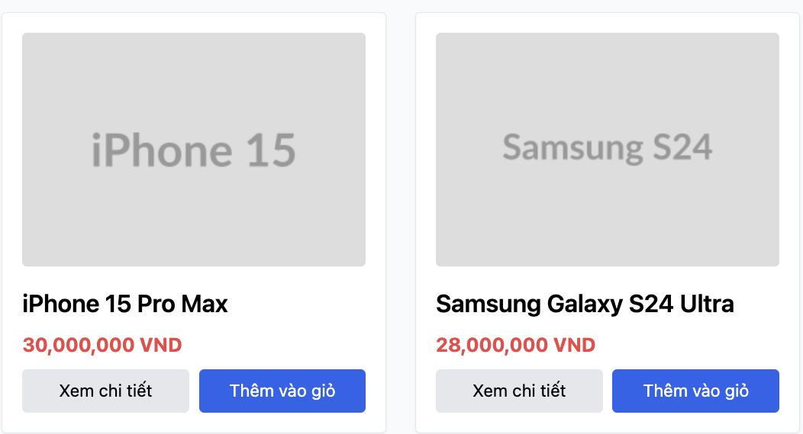

# BUG-IA02-HOMEPAGE-004: Thẻ sản phẩm trên trang chủ không cho biết sẽ thêm bao nhiêu đơn vị vào giỏ hàng

## Found by Test Case
GUI-086

## Requirement liên quan
FR-06 (trang chi tiết sản phẩm có ô nhập Số lượng); FR-22 (nhãn trường phải rõ
ràng). Trang chủ không có FR riêng mô tả số lượng, nhưng sự chênh lệch giữa hai
màn hình cùng làm một việc là vấn đề nhất quán giao diện theo FR-21.

## Severity / Priority
Minor / P3

## Environment
**Browser/Device**: Chrome (desktop, qua Claude for Chrome)
**OS**: macOS
**URL**: http://localhost:5173/
**Build/commit**: eshop-sut @ 85af3ba

## Steps to reproduce
1. Mở trang chủ, xem một thẻ sản phẩm bất kỳ trong lưới.
2. Quan sát các thành phần trên thẻ: ảnh, tên, giá, nút "Xem chi tiết", nút
   "Thêm vào giỏ".
3. Bấm "Thêm vào giỏ" một lần, rồi vào Giỏ hàng kiểm tra số lượng đã thêm.
4. Đối chiếu với trang chi tiết của cùng sản phẩm đó, nơi có ô "Số lượng".

## Expected result
Người dùng biết được sẽ thêm bao nhiêu đơn vị trước khi bấm, hoặc giao diện nói
rõ rằng nút này thêm đúng 1 đơn vị. Hai lối vào giỏ hàng của cùng một sản phẩm
nên nhất quán với nhau về mặt này.

## Actual result
Thẻ sản phẩm trên trang chủ chỉ có đúng 1 nút "Thêm vào giỏ", không có ô nhập
cũng không có bất kỳ chỉ báo số lượng nào. Bấm nút luôn thêm đúng 1 đơn vị,
nhưng người dùng không có cách nào biết trước điều đó từ giao diện. Trong khi
đó trang chi tiết của cùng sản phẩm lại có ô "Số lượng" cho phép chọn. Người
dùng muốn mua nhiều hơn 1 sẽ hoặc bấm nút nhiều lần (tạo ra các dòng trùng
trong giỏ, xem `BUG-IA04-PRODUCTDETAIL-001`), hoặc phải tự đoán rằng cần vào
trang chi tiết mới chọn được số lượng.

## Evidence

## GitHub Issue
https://github.com/lmchkhi/CS423-CSC15003-Testing-N08/issues/196
