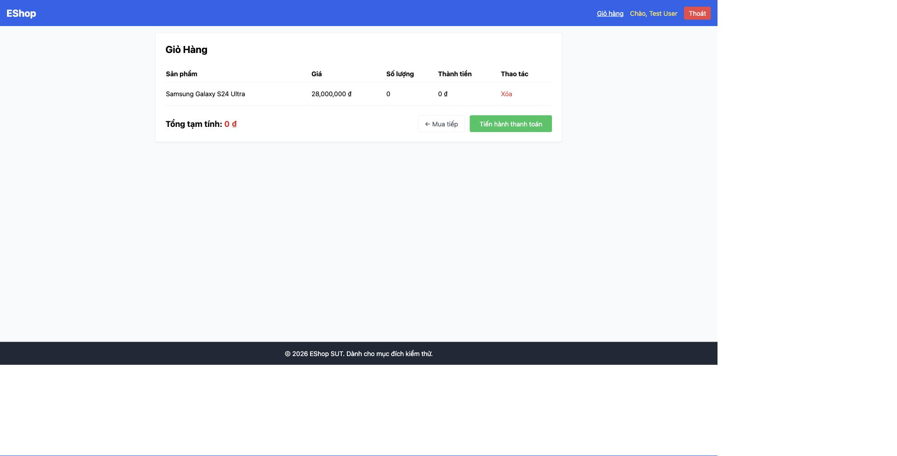
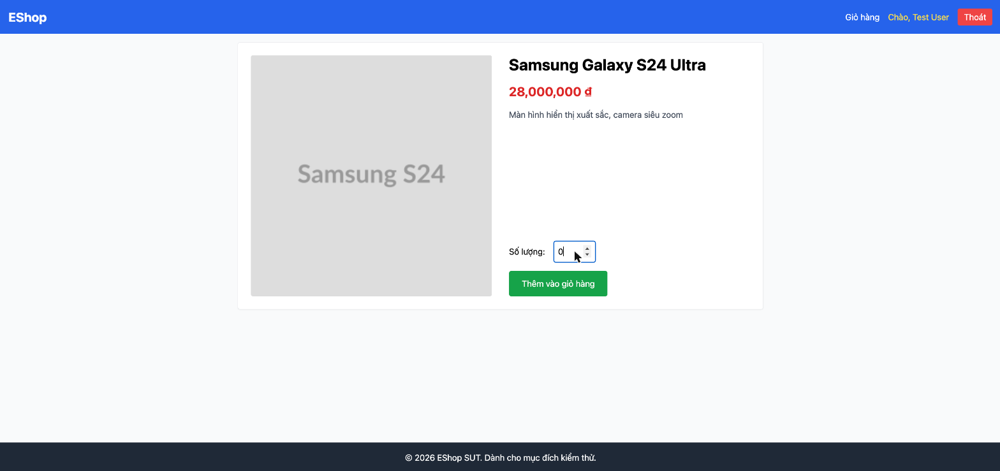

# BUG-IA02-PRODUCTDETAIL-001: Ô nhập Số lượng không có validation — cho phép thêm số lượng 0 vào giỏ hàng mà không báo lỗi

## Found by Test Case
GUI-013, GUI-015, GUI-017, GUI-020, GUI-021

## Requirement liên quan
FR-06 (Có ô nhập Số lượng — chỉ nhận số nguyên dương, tối thiểu là 1); FR-22 (Form Requirements — trường bắt buộc phải có `*`, thông báo lỗi phải hiện trên nút submit)

## Severity / Priority
Critical / P1

## Environment
**Browser/Device**: Chrome (desktop, qua Claude for Chrome)
**OS**: macOS
**URL**: http://localhost:5173/product/2
**Build/commit**: eshop-sut @ 85af3ba
**Tài khoản**: test@eshop.com (đã đăng nhập)

## Steps to reproduce
1. Vào trang chi tiết sản phẩm (vd Samsung Galaxy S24 Ultra, /product/2).
2. Xóa ô Số lượng và nhập `0`.
3. Bấm "Thêm vào giỏ hàng" hai lần (xem BUG-IA04-PRODUCTDETAIL-001 về việc vì sao cần bấm 2 lần).
4. Vào trang Giỏ hàng.

## Expected result
- Hệ thống phải từ chối số lượng 0 (tối thiểu là 1 theo FR-06), hiển thị lỗi ngay phía trên nút submit.
- Nhãn "Số lượng:" phải có ký hiệu `*` vì là trường bắt buộc (FR-22).

## Actual result
- Sản phẩm với số lượng = 0 được thêm thành công vào giỏ hàng (dòng "Samsung Galaxy S24 Ultra — Số lượng: 0 — Thành tiền: 0 ₫"), không có bất kỳ thông báo lỗi nào.
- Input số lượng không có thuộc tính `min`/`max`/`step` (`<input type="number" .../>` trống, xác nhận qua DOM và source `ProductDetail.jsx` dòng 56-61: `onChange={(e) => setQuantity(e.target.value)}`, không có validate).
- Giá trị được đưa thẳng vào `addToCart(product, parseInt(quantity))` mà không qua bất kỳ điều kiện kiểm tra nào.
- Nhãn "Số lượng:" không có dấu `*`.
- Do đó nút submit không bao giờ bị disable và không có cơ chế validate on-blur/on-submit nào tồn tại.

## Evidence

## GitHub Issue
https://github.com/lmchkhi/CS423-CSC15003-Testing-N08/issues/97
