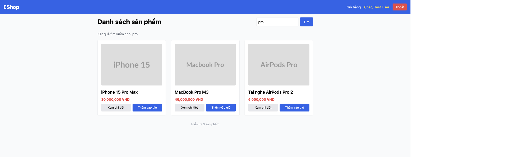

# BUG-IA02-SEARCHRESULTS-001: Không có cách nào để xóa bộ lọc tìm kiếm và quay về xem toàn bộ sản phẩm

## Found by Test Case
GUI-090

## Requirement liên quan
FR-05 (Xem danh sách & Tìm kiếm sản phẩm)

## Severity / Priority
Minor / P3

## Environment
**Browser/Device**: Chrome (desktop, qua Claude for Chrome)
**OS**: macOS
**URL**: http://localhost:5173/
**Build/commit**: eshop-sut @ 85af3ba

## Steps to reproduce
1. Tại trang chủ, tìm kiếm từ khóa "pro" (đúng cách: gõ vào ô tìm kiếm rồi bấm nút "Tìm") — kết quả lọc còn 3 sản phẩm.
2. Quan sát toàn bộ trang: chỉ có ô tìm kiếm, nút "Tìm", và các thẻ sản phẩm — không có bất kỳ nút/link nào dạng "Xóa bộ lọc" / "Xem tất cả sản phẩm" / "X" trên ô tìm kiếm.
3. Kiểm tra qua DOM (`document.querySelectorAll('a,button')`): danh sách link/button chỉ gồm "EShop", "Giỏ hàng", "Chào, Test User", "Thoát", "Tìm", "Xem chi tiết", "Thêm vào giỏ" — không có control nào khác.

## Expected result
Khi đang xem kết quả tìm kiếm đã lọc, phải có một cách rõ ràng (nút, link, hoặc icon "x" trên ô tìm kiếm) để xóa bộ lọc và quay về xem toàn bộ danh sách sản phẩm mà không cần tự tay xóa nội dung ô tìm kiếm rồi bấm "Tìm" lại.

## Actual result
Người dùng phải tự xóa tay toàn bộ nội dung ô tìm kiếm rồi bấm "Tìm" lại (hoặc Enter) để quay về danh sách đầy đủ — không có affordance nào hướng dẫn hoặc rút ngắn thao tác này.

## Evidence

## GitHub Issue
https://github.com/lmchkhi/CS423-CSC15003-Testing-N08/issues/190
