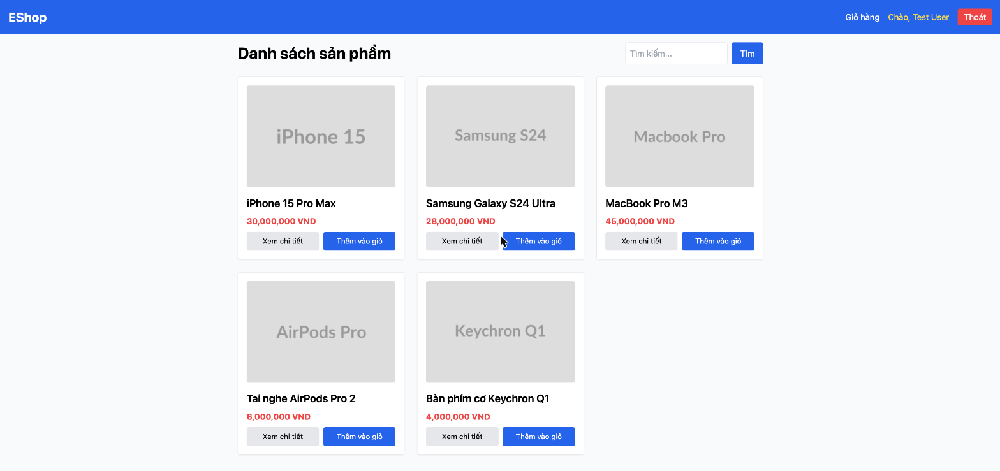

# BUG-IA03-HOMEPAGE-001: Không có cơ chế highlight mục đang chọn trên Navbar (không có mục "Trang chủ")

## Found by Test Case
GUI-067

## Requirement liên quan
FR-23 (Thanh điều hướng (Navbar) phải highlight trang đang được chọn)

## Severity / Priority
Minor / P2

## Environment
**Browser/Device**: Chrome (desktop, qua Claude for Chrome)
**OS**: macOS
**URL**: http://localhost:5173/
**Build/commit**: eshop-sut @ 85af3ba

## Steps to reproduce
1. Đọc DOM của navbar: `<nav class="flex gap-4 items-center"><a href="/cart">Giỏ hàng</a>
<a href="/profile">Chào, Test User</a><button>Thoát</button>
</nav>` — không có link "Trang chủ" nào trong `<nav>`; logo "EShop" nằm ngoài `<nav>`, link về "/" nhưng không có style active-state nào.
2. So sánh style của các link khi ở trang chủ vs trang khác (Giỏ hàng, Product Detail) — không có class nào thay đổi theo route hiện tại ở bất kỳ link nào trong navbar.

## Expected result
Navbar phải có cơ chế highlight rõ mục đang được chọn (ví dụ: đổi màu/underline link "Trang chủ" khi đang ở "/"), theo FR-23.

## Actual result
Không tồn tại mục "Trang chủ" trong navbar, và không có bất kỳ cơ chế active-state nào cho toàn bộ navbar (kể cả khi ở trang khác) — người dùng không có cách nào biết mình đang ở đâu chỉ qua navbar.

## Evidence

## GitHub Issue
https://github.com/lmchkhi/CS423-CSC15003-Testing-N08/issues/107
