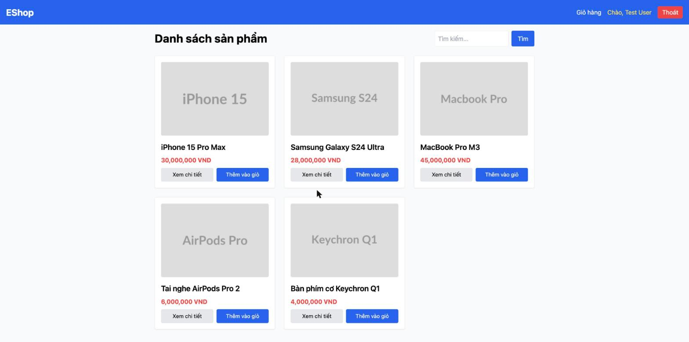

# BUG-IA03-HOMEPAGE-002: Bấm Back từ trang chi tiết sản phẩm về trang chủ làm mất từ khóa tìm kiếm và kết quả đã lọc

## Found by Test Case
GUI-071

## Requirement liên quan
IA03 chuẩn (Browser back/forward phải giữ đúng trạng thái, không mất dữ liệu)

## Severity / Priority
Major / P1

## Environment
**Browser/Device**: Chrome (desktop, qua Claude for Chrome)
**OS**: macOS
**URL**: http://localhost:5173/
**Build/commit**: eshop-sut @ 85af3ba

## Steps to reproduce
1. Tại trang chủ, tìm kiếm từ khóa "pro" — kết quả lọc còn 3 sản phẩm (iPhone 15 Pro Max, MacBook Pro M3, AirPods Pro 2).
2. Bấm "Xem chi tiết" MacBook Pro M3 → điều hướng sang `/product/3`.
3. Bấm nút Back của trình duyệt → quay lại `/`.
4. Quan sát: ô tìm kiếm trống rỗng, toàn bộ 5 sản phẩm hiển thị lại (không còn lọc theo "pro"), dòng "Kết quả tìm kiếm cho: pro" biến mất hoàn toàn.
5. Nguyên nhân: `Home.jsx` dùng `useEffect(() => { fetchProducts(); }, [])` — mỗi lần component mount lại (kể cả khi quay lại bằng Back) đều gọi lại `fetchProducts()` không kèm query, và state `search` reset về rỗng vì không được lưu ở URL (không dùng query param `?search=`) hay bất kỳ cơ chế lưu trạng thái nào khác.

## Expected result
Bấm Back từ trang chi tiết sản phẩm phải quay lại đúng trạng thái trước đó của trang chủ — giữ nguyên từ khóa tìm kiếm và kết quả đã lọc (lý tưởng là đưa từ khóa vào query string URL để trạng thái là một phần của lịch sử điều hướng).

## Actual result
Từ khóa tìm kiếm và kết quả lọc bị mất hoàn toàn sau khi Back — người dùng phải tìm kiếm lại từ đầu, trải nghiệm gây khó chịu đặc biệt khi danh sách sản phẩm dài.

## Evidence

