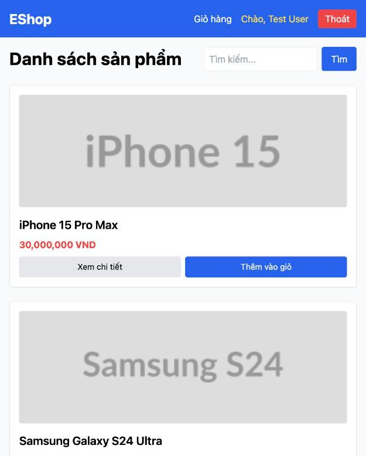

# BUG-IA03-HOMEPAGE-003: Chiều cao nút "Xem chi tiết"/"Thêm vào giỏ" trên mobile dưới ngưỡng tap target khuyến nghị

## Found by Test Case
GUI-074

## Requirement liên quan
IA03 chuẩn (Mobile: tap target tối thiểu ~44×44px, không chồng lấn)

## Severity / Priority
Minor / P3

## Environment
**Browser/Device**: Chrome, viewport mobile 390px (thực tế công cụ resize giới hạn ở ~625px CSS width)
**OS**: macOS
**URL**: http://localhost:5173/
**Build/commit**: eshop-sut @ 85af3ba

## Steps to reproduce
1. Thu nhỏ viewport xuống kích thước mobile (390×800, thực tế render ở ~625px do giới hạn công cụ).
2. Đo kích thước nút qua `getBoundingClientRect()`: nút "Xem chi tiết" và "Thêm vào giỏ" đều có `width: 275.9px, height: 36px`.
3. Không có hiện tượng chồng lấn giữa 2 nút (đủ khoảng cách `gap-2`), nhưng chiều cao 36px thấp hơn ngưỡng khuyến nghị 44px cho tap target trên mobile.

## Expected result
Vùng bấm của các nút trên mobile nên đạt tối thiểu ~44×44px để dễ bấm trúng bằng ngón tay, theo khuyến nghị accessibility chuẩn (WCAG 2.5.5, Apple/Material tap target guideline).

## Actual result
Chiều cao nút chỉ 36px (thiếu ~8px so với khuyến nghị), không gây chồng lấn nhưng vẫn dưới chuẩn tap target tối thiểu, có thể gây khó bấm trúng cho một số người dùng trên màn hình nhỏ.

## Evidence

## GitHub Issue
https://github.com/lmchkhi/CS423-CSC15003-Testing-N08/issues/109
