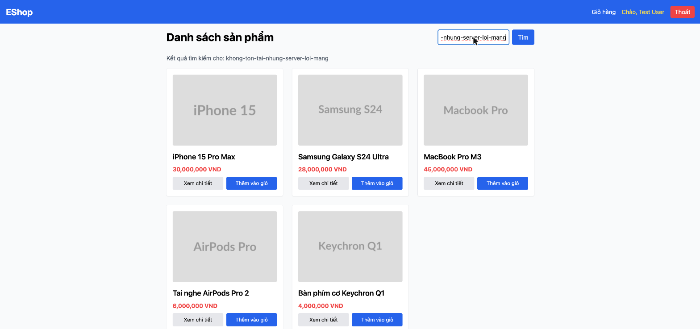

# BUG-IA04-HOMEPAGE-003: Khi API tìm kiếm/tải sản phẩm thất bại thật (lỗi mạng), giao diện âm thầm hiển thị dữ liệu cũ như thể thành công

## Found by Test Case
GUI-079

## Requirement liên quan
IA04 chuẩn (Error feedback phải cụ thể, không phải im lặng/màn trắng)

## Severity / Priority
Critical / P1

## Environment
**Browser/Device**: Chrome (desktop), mô phỏng lỗi mạng bằng cách patch `XMLHttpRequest.prototype.open` để chuyển hướng request `/api/products` sang một cổng không tồn tại rồi tự bắn sự kiện `error`
**OS**: macOS
**URL**: http://localhost:5173/
**Build/commit**: eshop-sut @ 85af3ba

## Steps to reproduce
1. Patch `window.XMLHttpRequest` qua console để mọi request tới `/api/products` bị chuyển hướng tới `http://localhost:9999/blackhole` (cổng không có server) và bắn sự kiện `error` sau 10ms.
2. Gõ vào ô tìm kiếm một chuỗi vô nghĩa (`khong-ton-tai-nhung-server-loi-mang`) rồi bấm Tìm.
3. Quan sát: dòng "Kết quả tìm kiếm cho: khong-ton-tai-nhung-server-loi-mang" xuất hiện bình thường, và **toàn bộ 5 sản phẩm cũ vẫn hiển thị** như thể tìm kiếm thành công và khớp tất cả, không có bất kỳ thông báo lỗi, màn trắng, hay dấu hiệu nào cho biết request đã thất bại.
4. Kiểm tra console: không có log lỗi nào được ghi nhận.
5. Lặp lại với nhiều từ khóa khác nhau trong cùng điều kiện lỗi mạng giả lập, luôn cùng một kết quả: dữ liệu sản phẩm cũ (lần fetch thành công gần nhất) vẫn được giữ nguyên trên màn hình như thể request mới đã thành công, không có bất kỳ thông báo lỗi hay dấu hiệu nào cho người dùng biết request thực sự đã thất bại.

## Expected result
Khi request tải/tìm kiếm sản phẩm thất bại vì lỗi mạng, giao diện phải hiển thị thông báo lỗi rõ ràng (ví dụ "Không thể kết nối máy chủ, vui lòng thử lại"), không được hiển thị dữ liệu cũ như thể thao tác đã thành công.

## Actual result
Giao diện hiển thị nhãn tìm kiếm và toàn bộ sản phẩm cũ một cách "giả thành công" khi request thực sự đã thất bại hoàn toàn, đây là lỗi nghiêm trọng hơn một thông báo lỗi bị thiếu: người dùng bị đánh lừa tin rằng từ khóa của họ khớp với tất cả 5 sản phẩm, trong khi thực tế server chưa từng phản hồi.

## Evidence

## Cũng xác nhận trên màn Search Results
Cùng root cause tái hiện ở một ngữ cảnh khác khi kiểm thử trực tiếp màn
Search Results (GUI-097, `checklist/gui-checklist.md`): lần này lỗi mạng giả
lập xảy ra **trong lúc người dùng đã đang xem một kết quả tìm kiếm hợp lệ
trước đó** (đã có 3 sản phẩm khớp "pro"), không phải lúc tải trang lần đầu.
Gõ từ khóa mới ("iphone") rồi bấm Tìm trong điều kiện `/api/products` bị
patch để luôn fail: dòng "Kết quả tìm kiếm cho: iphone" cập nhật đúng,
nhưng lưới sản phẩm vẫn giữ nguyên 3 kết quả cũ của "pro" (không phải 5 sản
phẩm gốc như ở Home Page, mà là kết quả lọc gần nhất trước lỗi), xác nhận
`document.body.innerText` không chứa bất kỳ từ nào liên quan lỗi
("lỗi"/"error"/"thất bại"). Chứng minh: hành vi "âm thầm giữ dữ liệu cũ khi
request thất bại" không chỉ xảy ra ở lần tải đầu tiên mà ở bất kỳ thời điểm
nào request thất bại, kể cả khi đang xem một trạng thái đã lọc hợp lệ.

## GitHub Issue
https://github.com/lmchkhi/CS423-CSC15003-Testing-N08/issues/112
