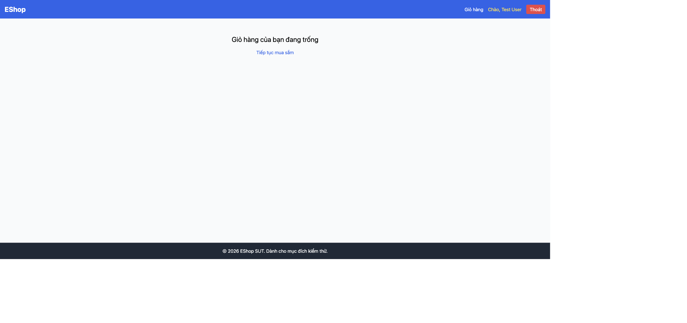

# BUG-IA04-PRODUCTDETAIL-001: Nút "Thêm vào giỏ hàng" cần bấm 2 lần mới có tác dụng, lần bấm đầu tiên im lặng không phản hồi; giỏ hàng không có toast/badge và mất hoàn toàn khi tải lại trang

## Found by Test Case
GUI-033, GUI-034, GUI-037, GUI-038, GUI-039, GUI-040, GUI-041, GUI-044, GUI-046

## Requirement liên quan
FR-06 (nút Thêm vào giỏ hàng: sau khi bấm phải hiển thị phản hồi trực quan); FR-24 (phản hồi trực quan toast/badge sau khi bấm Thêm vào giỏ); FR-23 (link Giỏ hàng phải hiển thị badge số lượng); FR-07 (thêm cùng sản phẩm phải tăng số lượng, không tạo dòng mới)

## Severity / Priority
Critical / P0

## Environment
**Browser/Device**: Chrome (desktop, qua Claude for Chrome)
**OS**: macOS
**URL**: http://localhost:5173/product/1
**Build/commit**: eshop-sut @ 85af3ba
**Tài khoản**: test@eshop.com (đã đăng nhập), hành vi giống hệt khi chưa đăng nhập (khách)

## Steps to reproduce
1. Vào trang chi tiết sản phẩm bất kỳ, để số lượng mặc định = 1.
2. Bấm "Thêm vào giỏ hàng" đúng **một lần**, quan sát trang: không có toast, không có badge, chữ trên nút không đổi ("Thêm vào giỏ hàng").
3. Mở tab Network: xác nhận không có request nào được gửi đi (0 request tới bất kỳ endpoint `/api/*` nào liên quan giỏ hàng).
4. Vào trang Giỏ hàng bằng link "Giỏ hàng" trên navbar (client-side navigation), giỏ hàng trống.
5. Quay lại trang chi tiết, bấm "Thêm vào giỏ hàng" **lần thứ hai liên tiếp**, lần này chữ trên nút đổi thành "Đã thêm" trong 2 giây, và item mới xuất hiện trong giỏ hàng.
6. Tải lại trang (F5) hoặc điều hướng bằng URL trực tiếp (hard navigation) sau khi đã thêm hàng thành công, giỏ hàng trống trở lại, không có cảnh báo nào cho người dùng.
7. Lặp lại quy trình bấm 1 lần / 2 lần liên tiếp trên nhiều sản phẩm khác nhau: xác nhận đây là hành vi nhất quán, có quy luật rõ ràng (luôn là lần bấm thứ hai mới có tác dụng, không phải ngẫu nhiên). Kiểm tra tab Application (DevTools) → Local Storage: rỗng, xác nhận giỏ hàng không được lưu bền vững ở bất kỳ đâu ngoài bộ nhớ tạm của trang.
8. Rà soát navbar ở mọi trạng thái giỏ hàng (0, 1, 2+ sản phẩm) trên toàn bộ các trang, không phát hiện badge số lượng xuất hiện ở bất kỳ đâu cạnh link "Giỏ hàng".
9. Thêm cùng một sản phẩm hai lần liên tiếp (đã bấm đủ số lần cần thiết cho mỗi lần) rồi vào trang Giỏ hàng, quan sát 2 dòng riêng biệt cùng sản phẩm thay vì 1 dòng đã cộng dồn số lượng.

## Expected result
- Mỗi lần bấm "Thêm vào giỏ hàng" (kể cả lần đầu) phải thêm đúng sản phẩm vào giỏ và hiển thị phản hồi trực quan ngay lập tức (toast và/hoặc badge số lượng cập nhật), theo FR-06/FR-24.
- Badge số lượng trên link "Giỏ hàng" ở navbar phải hiển thị và cập nhật đồng bộ (FR-23).
- Thêm cùng sản phẩm nhiều lần phải cộng dồn số lượng trên cùng một dòng, không tạo dòng trùng (FR-07).
- Giỏ hàng phải được lưu lại (qua API hoặc ít nhất `localStorage`) để không mất khi người dùng tải lại trang.

## Actual result
- Lần bấm đầu tiên của bất kỳ chuỗi thao tác "thêm vào giỏ" nào đều bị bỏ qua hoàn toàn, không có bất kỳ phản hồi nào cho người dùng (không toast, không đổi chữ nút, không lỗi), đây là hành vi cực kỳ khó phát hiện với người dùng thật, họ sẽ tưởng đã thêm thành công và rời trang.
- Chỉ có phản hồi (đổi chữ nút "Đã thêm" trong 2 giây) sau lần bấm **thứ hai** liên tiếp, không phải toast notification thực sự, chỉ là text trên chính nút, dễ bị bỏ lỡ.
- Không tồn tại badge số lượng ở link "Giỏ hàng" trên navbar trong bất kỳ trường hợp nào.
- Thêm cùng sản phẩm hai lần tạo ra hai dòng riêng biệt trong giỏ hàng thay vì cộng dồn số lượng.
- Giỏ hàng không được gọi API hay lưu `localStorage`: chỉ tồn tại trong bộ nhớ React của phiên hiện tại; tải lại trang (F5) làm mất toàn bộ giỏ hàng mà không có bất kỳ cảnh báo nào.
- Vì không có bất kỳ lệnh gọi mạng nào cho hành động thêm giỏ hàng, các kịch bản lỗi mạng/hết phiên đăng nhập/mạng chậm (GUI-038, GUI-044, GUI-046) không bao giờ có cơ hội được xử lý đúng cách, ứng dụng luôn "giả vờ" thành công dù dữ liệu chưa từng được lưu bền vững ở bất kỳ đâu.

## Evidence

## Cũng xác nhận trên Home Page
Cùng hành vi giỏ hàng (không toast/badge, không cộng dồn số lượng) tái hiện
trên trang chủ (GUI-068, GUI-076, GUI-077, GUI-081 trong
`checklist/gui-checklist.md`), qua nút "Thêm vào giỏ" trên từng thẻ sản
phẩm trong lưới:
- Không có toast/badge nào xuất hiện sau khi bấm (GUI-076/077), khác với
  Product Detail, ở đây nút hoạt động ngay từ **lần bấm đầu tiên** (xác nhận
  qua thao tác thực tế: 1 lần bấm là đủ để sản phẩm xuất hiện trong giỏ,
  không cần bấm lần hai như ở Product Detail), nhưng vẫn hoàn toàn không có
  phản hồi trực quan nào tại thời điểm bấm.
- Link "Giỏ hàng" trên navbar không có badge số lượng dù giỏ đã có 2 sản
  phẩm (GUI-068).
- Thêm cùng sản phẩm (iPhone 15 Pro Max) hai lần từ trang chủ tạo ra 2 dòng
  riêng biệt trong giỏ thay vì cộng dồn số lượng = 2 (GUI-081), xác nhận
  qua thao tác thật: giỏ hàng hiển thị 2 dòng "iPhone 15 Pro Max, Số lượng: 1"
  thay vì 1 dòng "Số lượng: 2".

## Cũng xác nhận qua Usability Testing (HW03 Task 2)

Đây chính là root cause của điểm nghẽn lớn nhất quan sát được ở 7 người
dùng thật (xem `usability/analysis.md`, Severity: Blocker/Major):
- **Blocker**: participant #7 (`usability/sessions/session-07.md`) lặp lại
  toàn bộ chu trình search → chi tiết → thêm giỏ hàng **3 lần liên tiếp**
  mà giỏ hàng vẫn trống ở lần kiểm tra cuối, task thất bại hoàn toàn, không
  chỉ là bối rối.
- **Major**: 4/7 participant khác (#1, #2, #3, #4) nêu trực tiếp trong câu
  trả lời probe rằng không biết đã thêm vào giỏ hàng thành công hay chưa vì
  không có thông báo nào; participant #2 vì vậy bấm lại nhiều lần và vô tình
  thêm dư sản phẩm (over-add), hệ quả trực tiếp của cùng cơ chế "lần bấm
  đầu bị bỏ qua im lặng" mô tả ở trên.

## GitHub Issue
https://github.com/lmchkhi/CS423-CSC15003-Testing-N08/issues/100
