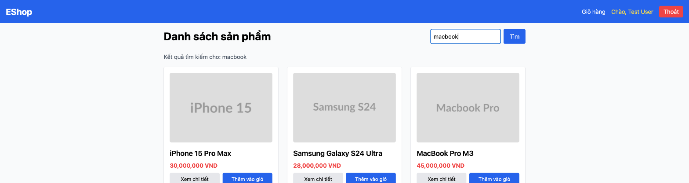

# BUG-IA04-SEARCHRESULTS-002: Dòng "Kết quả tìm kiếm cho" cập nhật ngay khi gõ nhưng lưới sản phẩm không nhất quán, có thể giữ dữ liệu cũ/sai không giới hạn thời gian

## Found by Test Case
GUI-096

## Requirement liên quan
IA04 chuẩn (feedback/state — nội dung hiển thị phải phản ánh đúng trạng thái thật, không gây hiểu nhầm)

## Severity / Priority
Major / P1

## Environment
**Browser/Device**: Chrome (desktop, qua Claude for Chrome)
**OS**: macOS
**URL**: http://localhost:5173/
**Build/commit**: eshop-sut @ 85af3ba

## Steps to reproduce
1. Tại trang chủ (danh sách đầy đủ 5 sản phẩm), click vào ô tìm kiếm và gõ "macbook" — **không bấm nút "Tìm" hoặc Enter**.
2. Quan sát: dòng "Kết quả tìm kiếm cho: macbook" xuất hiện ngay lập tức (cập nhật theo từng ký tự gõ), nhưng lưới sản phẩm bên dưới vẫn hiển thị **toàn bộ 5 sản phẩm cũ** (iPhone, Samsung, MacBook, AirPods, Keychron) thay vì chỉ 1 sản phẩm khớp ("MacBook Pro M3") — xác nhận qua DOM: `document.querySelectorAll('input')[0].value === 'macbook'` nhưng `document.querySelectorAll('img').length === 5`.
3. Lặp lại nhiều lần với các từ khóa khác nhau ("pro", "zzz", "macbookpro", " iphone "): hành vi **không nhất quán** giữa các lần thao tác giống hệt nhau — đôi khi lưới sản phẩm tự cập nhật đúng theo từng ký tự gõ (live), đôi khi lưới giữ nguyên dữ liệu cũ/sai cho đến khi người dùng chủ động bấm "Tìm" hoặc Enter để submit. Dòng "Kết quả tìm kiếm cho" thì luôn cập nhật ngay lập tức theo input, bất kể lưới sản phẩm đã đồng bộ hay chưa.
4. Trạng thái sai lệch (dòng chữ nói một từ khóa, lưới hiển thị sản phẩm của từ khóa khác/cũ) có thể tồn tại không giới hạn thời gian — không tự sửa nếu người dùng không chủ động bấm "Tìm"/Enter.

## Expected result
Dòng thông báo "Kết quả tìm kiếm cho" và lưới sản phẩm hiển thị bên dưới phải luôn đồng bộ với nhau và phản ánh đúng, nhất quán trạng thái tìm kiếm thật — không có khoảng thời gian nào (dù ngắn hay không giới hạn) mà 2 phần này thể hiện 2 dữ liệu khác nhau, và hành vi phải lặp lại giống nhau (deterministic) cho cùng một thao tác.

## Actual result
Lưới sản phẩm và dòng chú thích kết quả có thể lệch nhau — dòng chú thích luôn "đi trước" theo input gõ tay, còn lưới sản phẩm cập nhật không nhất quán (có lúc live theo từng ký tự, có lúc chỉ cập nhật khi submit). Người dùng có thể tin rằng hệ thống đã tìm ra đúng kết quả (dựa vào dòng chữ) trong khi lưới đang hiển thị dữ liệu của một tìm kiếm khác hoặc dữ liệu cũ chưa lọc.

## Evidence

## GitHub Issue
