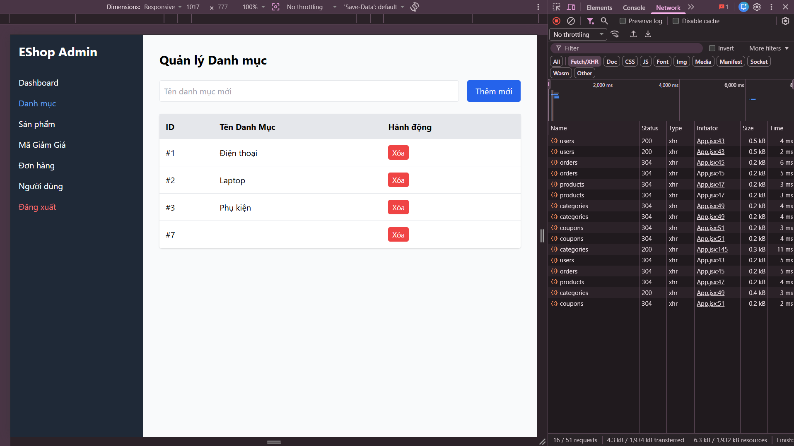

## Found by Test Case
USAB-ADMIN-FLOW-P01/P02/P04/P05

## Requirement liên quan
FR-14: Quản lý Danh mục (Category CRUD) - Tên danh mục là bắt buộc, không được để trống.

## Severity / Priority
Major / P1

## Environment
Web Admin URL `https://frontend-admin-livid-two.vercel.app/`, Chrome trên các device được ghi trong session notes.

## Steps to reproduce
1. Đăng nhập Web Admin bằng tài khoản admin hợp lệ.
2. Đi tới Category Management / Danh mục.
3. Để trống tên danh mục.
4. Submit form tạo danh mục.

## Expected result
Hệ thống chặn submit, không tạo category mới và hiển thị lỗi bắt buộc ở gần trường tên danh mục.

## Actual result
Hệ thống vẫn cho tạo category rỗng hoặc không hiển thị lỗi đủ rõ, làm participant phải tự phát hiện dữ liệu sai trong danh sách.

## Evidence
- Session notes: `reports/usability/session-notes/session-notes-P01.md`, `reports/usability/session-notes/session-notes-P02.md`, `reports/usability/session-notes/session-notes-P04.md`, `reports/usability/session-notes/session-notes-P05.md`
- Transcript examples:
  - `reports/usability/transcript/P04.txt`, `00:34-00:54`
  - `reports/usability/transcript/P05.txt`, `01:52-02:14`
- Screenshot: 

## GitHub issue
https://github.com/lmchkhi/CS423-CSC15003-Testing-N08/issues/199

## GitHub labels
- Type: Bug
- Status: New
- Module: Category CRUD
- Priority: P1
- Severity: Major
