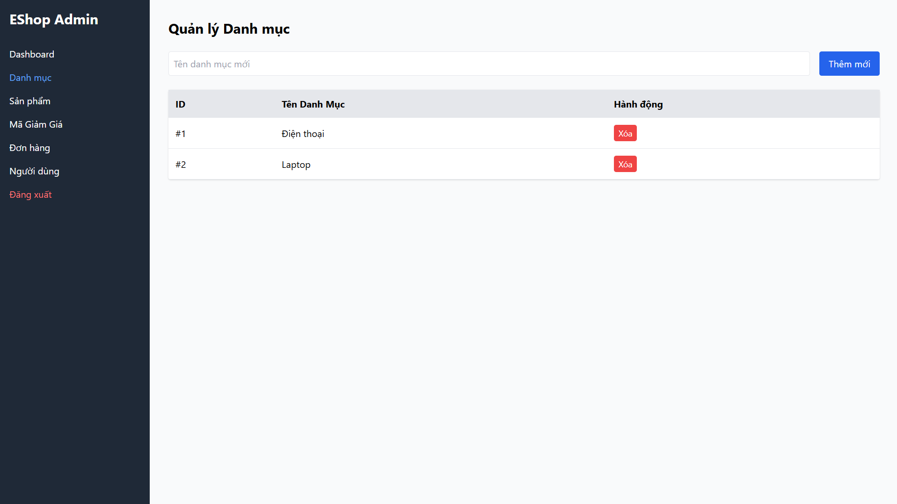

## Found by Test Case
USAB-ADMIN-FLOW-P01-P07

## Requirement liên quan
Risk-based usability requirement cho destructive actions; FR-14, FR-15 và FR-19 liên quan đến xóa category, product và user.

## Severity / Priority
Major / P1

## Environment
Web Admin URL `https://frontend-admin-livid-two.vercel.app/`, các browser/device được ghi trong `reports/usability/session-notes/session-notes-P01.md` đến `reports/usability/session-notes/session-notes-P07.md`.

## Steps to reproduce
1. Đăng nhập Web Admin bằng tài khoản admin hợp lệ.
2. Thực hiện một thao tác xóa trên category, product hoặc user test.
3. Quan sát hệ thống có hỏi xác nhận trước khi xóa hay không.

## Expected result
Trước khi xóa dữ liệu, hệ thống hiển thị confirmation dialog nêu rõ đối tượng sắp bị xóa. Sau khi xác nhận, hệ thống hiển thị success/error feedback.

## Actual result
Thao tác xóa diễn ra ngay sau khi bấm nút xóa. Participant không có cơ hội xác nhận, dễ xóa nhầm category/product/user và làm giảm cảm giác an toàn.

## Evidence
- Session notes: `reports/usability/session-notes/session-notes-P01.md` đến `reports/usability/session-notes/session-notes-P07.md`
- Screenshot category delete: 
- Screenshot product delete: 
- Screenshot product delete after click: 
- Screenshot user delete: 
- Screenshot user delete after click: 

## GitHub issue
https://github.com/lmchkhi/CS423-CSC15003-Testing-N08/issues/200

## GitHub labels
- Type: Bug
- Status: New
- Module: All Admin Screens
- Priority: P1
- Severity: Major
