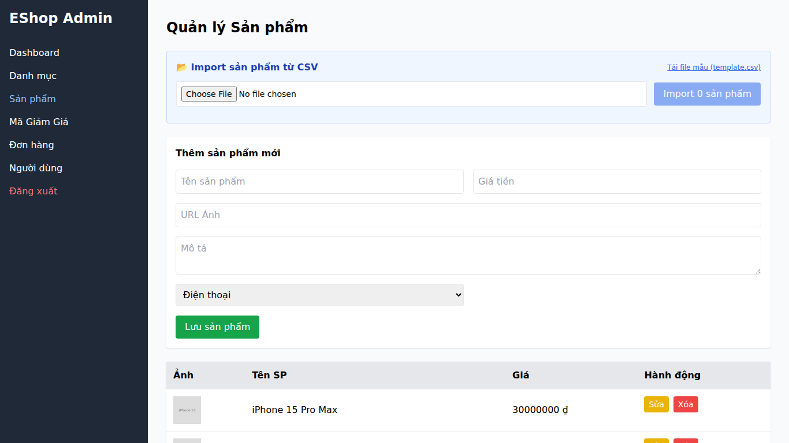

## Found by Test Case
USAB-ADMIN-FLOW-P02-P06

## Requirement liên quan
FR-15: Quản lý Sản phẩm (Product CRUD) - tên sản phẩm bắt buộc, tối đa 255 ký tự; giá bắt buộc và phải là số dương; danh mục bắt buộc.

## Severity / Priority
Major / P1

## Environment
Web Admin URL `https://frontend-admin-livid-two.vercel.app/`, Chrome trên các device được ghi trong session notes.

## Steps to reproduce
1. Đăng nhập Web Admin bằng tài khoản admin hợp lệ.
2. Đi tới Product Management / Sản phẩm.
3. Thử tạo product khi thiếu field bắt buộc hoặc nhập giá không hợp lệ.
4. Quan sát hệ thống có chặn submit và giải thích lỗi rõ ràng hay không.

## Expected result
Product form đánh dấu rõ các trường bắt buộc, chặn dữ liệu thiếu/không hợp lệ trước khi submit, và hiển thị lỗi cụ thể gần field để admin biết cách sửa.

## Actual result
Participant nhiều lần phải đoán field nào bắt buộc hoặc tự kiểm tra sau khi submit. Một số session ghi nhận hệ thống không hiển thị lỗi rõ khi dữ liệu thiếu/không hợp lệ, làm giảm error recovery và trust.

## Evidence
- Session notes: `reports/usability/session-notes/session-notes-P02.md`, `reports/usability/session-notes/session-notes-P03.md`, `reports/usability/session-notes/session-notes-P04.md`, `reports/usability/session-notes/session-notes-P05.md`, `reports/usability/session-notes/session-notes-P06.md`
- Related screenshots:
  - 
  - 
  - 

## GitHub issue
https://github.com/lmchkhi/CS423-CSC15003-Testing-N08/issues/201

## GitHub labels
- Type: Bug
- Status: New
- Module: Product Management
- Priority: P1
- Severity: Major
