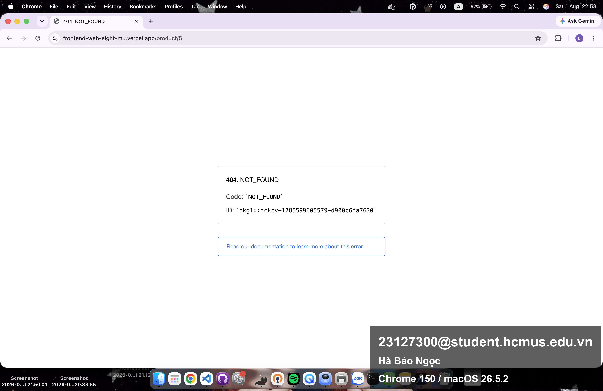
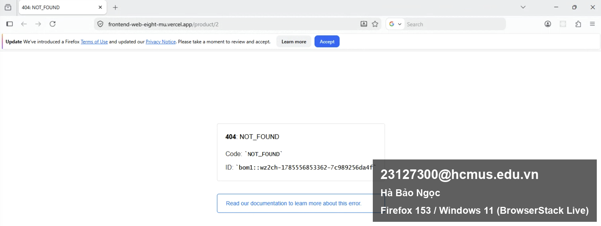
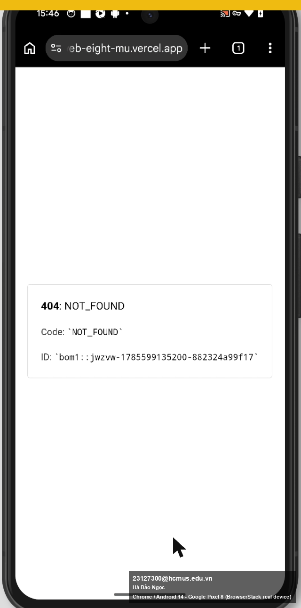

# BUG-XPLAT-DEEPLINK-001: Truy cập trực tiếp (deep link) hoặc tải lại trang chi tiết sản phẩm trên bản deploy thật trả về lỗi 404 NOT_FOUND của Vercel, chỉ hoạt động đúng qua điều hướng nội bộ SPA

## Found by Test Case
Task 3: Cross-Browser/Cross-Platform (tương ứng GUI-028 ở Task 1, vốn Passed khi test trên dev server localhost)

## Requirement liên quan
FR-06 (xem chi tiết sản phẩm); GUI-028 trong `checklist/gui-checklist.md` ("Truy cập trực tiếp bằng URL sản phẩm (deep link) hiển thị đúng trang chi tiết sản phẩm đó, không lỗi hoặc văng về trang chủ")

## Severity / Priority
Major / P1: không chặn được flow chính khi người dùng điều hướng bình thường trong app (SPA client-side routing hoạt động đúng), nhưng **chặn hoàn toàn** mọi cách truy cập khác: chia sẻ link sản phẩm, bookmark, mở link từ ngoài (mạng xã hội, tin nhắn), hoặc chỉ đơn giản là bấm F5/reload khi đang ở trang chi tiết.

## Environment
**Đây là bug chỉ xuất hiện trên bản deploy thật, KHÔNG xuất hiện trên dev server localhost đã dùng cho Task 1/2** (khác với mọi bug khác trong repo này):
- **URL**: https://frontend-web-eight-mu.vercel.app/ (Vercel, frontend deploy thật)
- **Backend**: https://eshop-backend-demo2.onrender.com (Render, xác nhận qua Network tab, hoạt động bình thường)
- Xác nhận trên **cả 3 platform** đã test ở Task 3, cùng một hành vi giống hệt nhau, xác nhận đây là lỗi cấu hình phía server/deploy, không phải lỗi trình duyệt cụ thể:
  1. Chrome / Android 14 (Google Pixel 8, BrowserStack real device)
  2. Chrome (desktop, local)
  3. Firefox 153 / Windows 11 (BrowserStack Live)

## Steps to reproduce
1. Vào thẳng URL `https://frontend-web-eight-mu.vercel.app/` (trang chủ): tải đúng, hiển thị danh sách sản phẩm.
2. Từ trang chủ, bấm "Xem chi tiết" một sản phẩm bất kỳ (vd Keychron Q1), điều hướng qua client-side routing (React Router), URL đổi thành `/product/5`, trang hiển thị đúng.
3. Bây giờ, gõ trực tiếp `https://frontend-web-eight-mu.vercel.app/product/5` vào thanh địa chỉ (hoặc F5 reload ngay tại trang chi tiết đó), trang trả về lỗi 404 của Vercel edge, không phải trang chi tiết sản phẩm.
4. Lặp lại với `/product/1`, `/product/2`: cùng lỗi 404 xảy ra với mọi ID sản phẩm, không riêng gì sản phẩm 5.
5. Xác nhận lỗi giống hệt trên cả 3 platform test (xem Environment).

## Expected result
Truy cập trực tiếp bằng URL sản phẩm (deep link) hoặc tải lại trang phải hiển thị đúng trang chi tiết sản phẩm đó, không lỗi, đúng yêu cầu GUI-028 (đã Passed khi test trên dev server, vì dev server Vite/React tự động rewrite mọi route về `index.html`).

## Actual result
- Vercel trả về trang lỗi tĩnh của chính nền tảng Vercel (không phải lỗi do code React của EShop):
  ```
  404: NOT_FOUND
  Code: NOT_FOUND
  ID: bom1::xxxx-xxxxxxxxxxxxx-xxxxxxxxxxxx
  ```
- Nguyên nhân nhiều khả năng: thiếu cấu hình SPA fallback rewrite (`vercel.json` với rule rewrite mọi route về `/index.html` để React Router tự xử lý phía client) trên bản deploy Vercel, chỉ route `/` (root) có file tĩnh khớp, mọi route con như `/product/:id` không có file tĩnh tương ứng nên Vercel edge trả 404 trước khi kịp giao cho React.
- Vì lỗi xảy ra ở tầng edge/hosting (trước khi JS bundle của EShop được tải), đây là vấn đề **cấu hình triển khai**, không phải lỗi trong mã nguồn React của EShop, nhưng vẫn ảnh hưởng trực tiếp tới trải nghiệm người dùng thật trên bản họ thực sự dùng.

## Evidence
Ảnh bằng chứng cho cả 3 platform đã nêu ở mục Environment:





## GitHub Issue
https://github.com/lmchkhi/CS423-CSC15003-Testing-N08/issues/197
