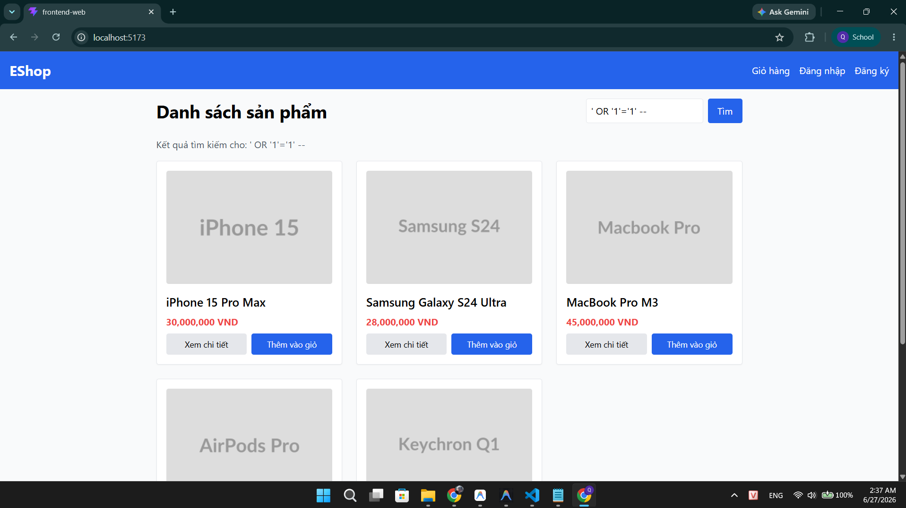

## Found by Test Case

TC-FR05-DT-007

## Requirement liên quan

FR-05, SEC-05

## Severity / Priority

Critical / P0

## Environment

- Browser: Chrome (latest)
- OS: Windows
- Frontend: http://localhost:5173
- Backend: http://localhost:3000

## Steps to reproduce

1. Mở trình duyệt, truy cập http://localhost:5173
2. Mở DevTools (F12) → tab Network
3. Nhập `' OR '1'='1' --` vào thanh tìm kiếm
4. Nhấn Enter hoặc nút tìm kiếm
5. Quan sát kết quả trả về và API response trong Network tab

## Expected result

Hệ thống xử lý an toàn payload SQL Injection, sử dụng parameterized queries (SEC-05). Trả về empty state hoặc kết quả hợp lệ, KHÔNG trả về toàn bộ sản phẩm bất thường.

## Actual result

SQL Injection thành công — hệ thống trả về TOÀN BỘ sản phẩm từ CSDL. Điều này chứng minh backend KHÔNG sử dụng parameterized queries (vi phạm SEC-05). Đây là lỗ hổng bảo mật nghiêm trọng cho phép attacker truy xuất hoặc thao túng dữ liệu trong CSDL.

## Evidence

TC-FR05-DT-007

