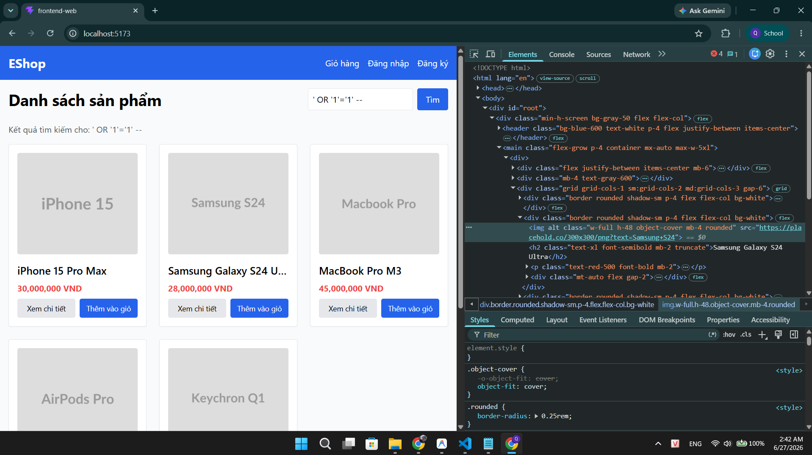
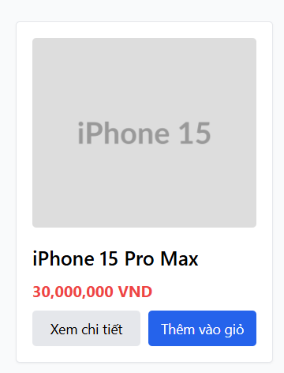

## Found by Test Case

TC-FR05-DT-009, TC-FR05-DT-012

## Requirement liên quan

FR-05, FR-21

## Severity / Priority

Minor / P2

## Environment

- Browser: Chrome (latest)
- OS: Windows
- Frontend: http://localhost:5173
- Backend: http://localhost:3000

## Steps to reproduce

1. Mở trình duyệt, truy cập http://localhost:5173
2. Chờ trang tải hoàn tất và danh sách sản phẩm hiển thị
3. Quan sát giá sản phẩm trên các product card
4. So sánh ký hiệu tiền tệ hiển thị với yêu cầu đặc tả

## Expected result

Giá sản phẩm hiển thị với ký hiệu `₫` và định dạng phân cách hàng nghìn (ví dụ: 150.000 ₫)

## Actual result

Giá sản phẩm hiển thị với ký hiệu `VND` thay vì `₫`. Phân cách hàng nghìn hoạt động đúng nhưng ký hiệu tiền tệ sai so với đặc tả FR-05 và FR-21.

## Evidence

TC-FR05-DT-009

TC-FR05-DT-012

