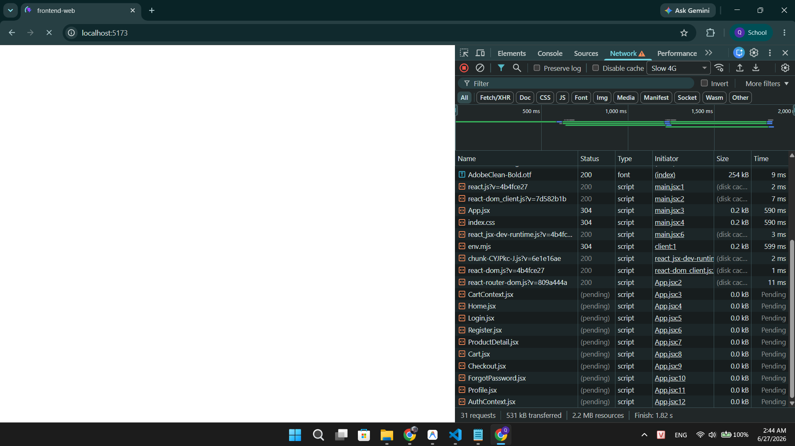

## Found by Test Case

TC-FR05-DT-010

## Requirement liên quan

FR-05

## Severity / Priority

Minor / P2

## Environment

- Browser: Chrome (latest)
- OS: Windows
- Frontend: http://localhost:5173
- Backend: http://localhost:3000

## Steps to reproduce

1. Mở trình duyệt, truy cập http://localhost:5173
2. Mở DevTools (F12) → tab Network
3. Chọn Throttling: Slow 3G để giảm tốc độ mạng
4. Refresh trang (F5 hoặc Ctrl+R)
5. Quan sát khu vực danh sách sản phẩm trong lúc dữ liệu đang tải

## Expected result

Hiển thị loading indicator (spinner, skeleton screen, hoặc text "Đang tải...") trong khi dữ liệu đang được fetch từ API

## Actual result

Không có loading indicator nào hiển thị. Trang hiển thị trắng/trống trong thời gian chờ dữ liệu tải về, không có phản hồi trực quan cho người dùng.

## Evidence

TC-FR05-DT-010

