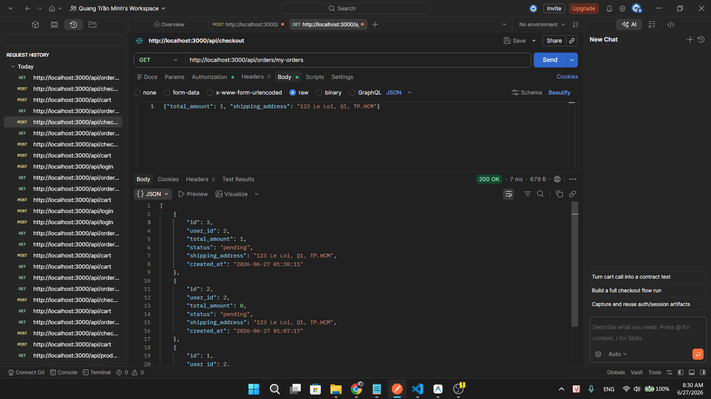
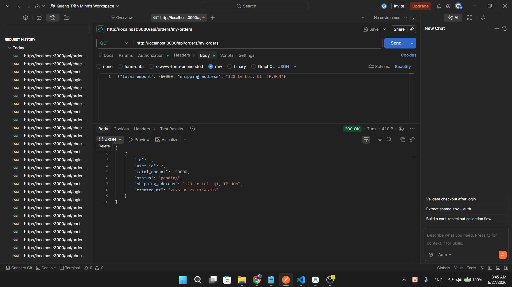
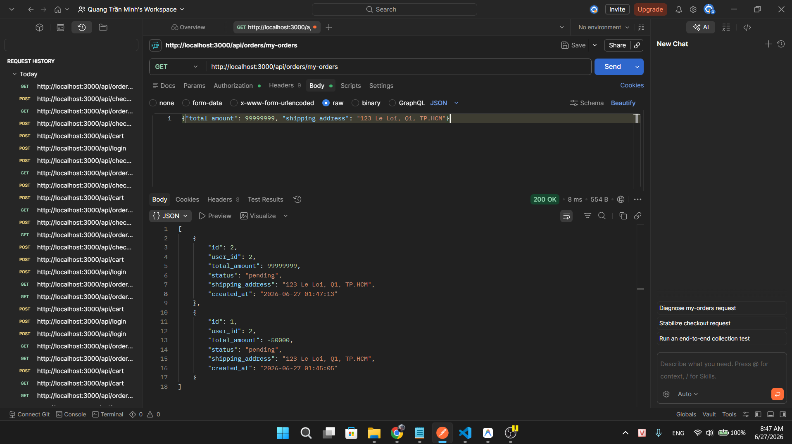
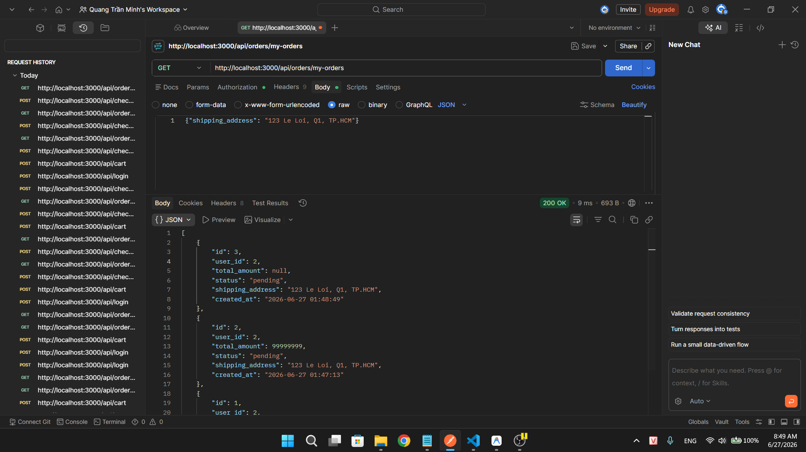
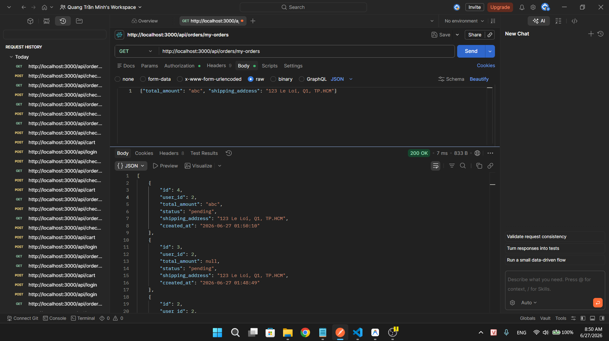
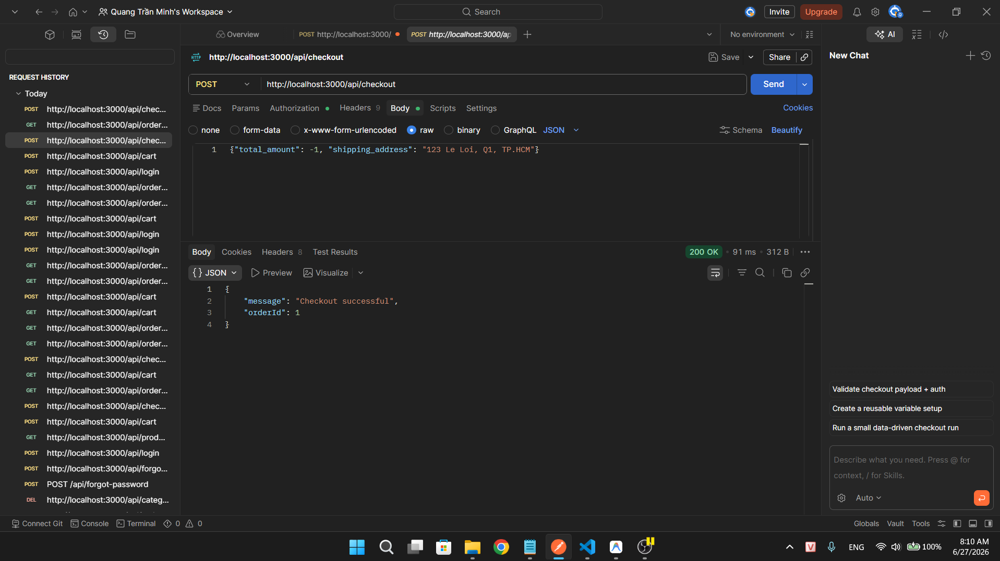
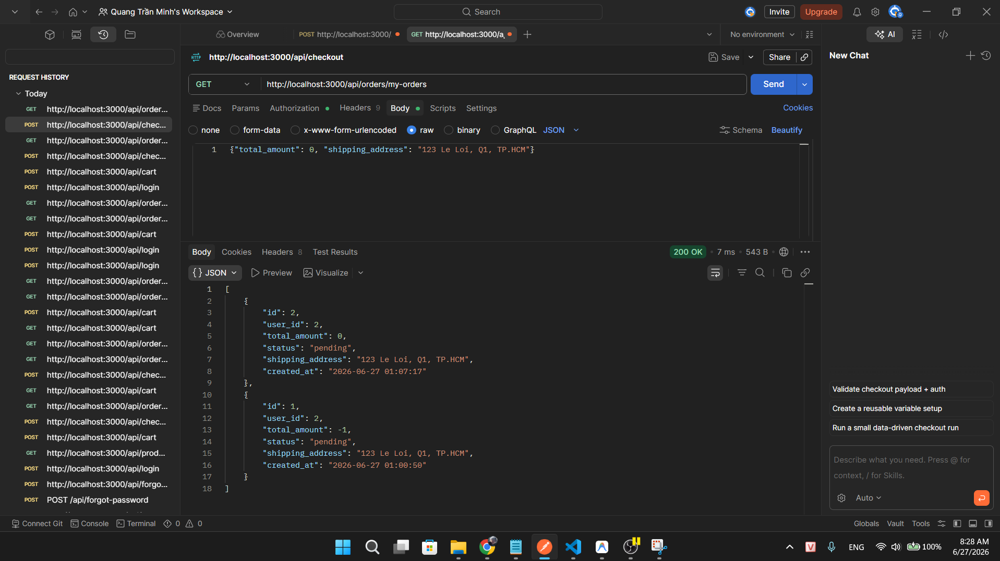

## Found by Test Case

TC-FR08-DT-004, TC-FR08-DT-005, TC-FR08-DT-006, TC-FR08-DT-007, TC-FR08-DT-008, TC-FR08-DT-009, TC-FR08-BVA-001, TC-FR08-BVA-002, TC-FR08-BVA-003

## Requirement liên quan

FR-08: _"Backend phải tự tính lại tổng tiền; không chấp nhận giá trị `total_amount` do client gửi lên."_

## Severity / Priority

Critical / P0

## Environment

- Backend: EShop API — `http://localhost:3000`
- Tool: Postman
- OS: Windows
- Endpoint: `POST /api/checkout`

## Steps to reproduce

1. Đăng nhập `POST /api/login` với `test@eshop.com` / `Test1234!` → lưu `token`
2. Thêm sản phẩm vào giỏ `POST /api/cart` với `{"id": 1, "name": "Sản phẩm A", "price": 100000, "quantity": 2}` (tổng thực tế = 200,000₫)
3. Gửi `POST /api/checkout` qua **Postman** với body:
   ```json
   {
     "total_amount": 1,
     "shipping_address": "123 Le Loi, Q1, TP.HCM"
   }
   ```
   Header: `Authorization: Bearer <token>`
4. Gửi `GET /api/orders/my-orders` để kiểm tra đơn hàng mới nhất

## Expected result

- Đơn hàng được tạo với `total_amount` = **200,000₫** (backend tự tính từ giỏ hàng)
- Backend bỏ qua hoàn toàn giá trị `total_amount` do client gửi

## Actual result

- Đơn hàng được tạo với `total_amount` = **1₫** (backend chấp nhận nguyên giá trị client gửi)
- Hacker có thể mua hàng trị giá 200,000₫ chỉ với 1₫
- Các giá trị khác cũng bị chấp nhận: `0` (mua miễn phí), `-50000` (hoàn tiền âm), `99999999` (over-charge), `"abc"` (kiểu sai), `null` (thiếu trường → tổng = null)

## Evidence

| total_amount gửi | total_amount lưu trong DB | Kết quả |
| --- | --- | --- |
| `1` | 1₫ | 🐛 Backend tin client |
| `0` | 0₫ | 🐛 Mua hàng miễn phí |
| `-50000` | -50,000₫ | 🐛 Đơn hàng âm tiền |
| `99999999` | 99,999,999₫ | 🐛 Over-charge |
| `"abc"` | "abc" | 🐛 Không validate kiểu |
| *(missing)* | null | 🐛 Không có tổng tiền |

TC-FR08-DT-004


TC-FR08-DT-005


TC-FR08-DT-006


TC-FR08-DT-007


TC-FR08-DT-008


TC-FR08-DT-009


TC-FR08-BVA-001


TC-FR08-BVA-002


TC-FR08-BVA-003

