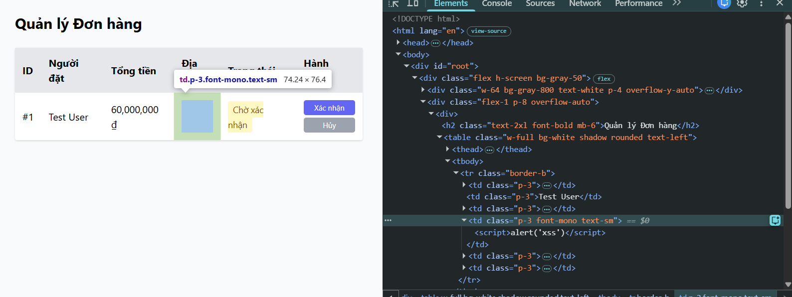

## Found by Test Case

TC-FR08-DT-012

## Requirement liên quan

FR-08, FR-18: _"Địa chỉ giao hàng phải được hiển thị an toàn (không render HTML)"_, SEC-04: _"Mọi dữ liệu từ user nhập vào khi hiển thị trên UI phải được escape đúng cách, không dùng innerHTML trực tiếp."_

## Severity / Priority

Major / P1

## Environment

- Backend: EShop API — `http://localhost:3000`
- Admin Web: `http://localhost:5174`
- Tool: Postman + Chrome DevTools
- OS: Windows

## Steps to reproduce

1. Đăng nhập `POST /api/login` với `test@eshop.com` / `Test1234!` → lưu `token`
2. Thêm sản phẩm vào giỏ hàng
3. Gửi `POST /api/checkout` qua **Postman** với body:
   ```json
   {
     "total_amount": 200000,
     "shipping_address": "<script>alert('xss')</script>"
   }
   ```
   Header: `Authorization: Bearer <token>`
4. Đăng nhập Admin tại `http://localhost:5174` với `admin@eshop.com` / `Admin123!`
5. Vào trang **Quản lý Đơn hàng**
6. Mở Chrome DevTools (F12) → Tab Elements
7. Inspect ô chứa địa chỉ giao hàng của đơn hàng vừa tạo

## Expected result

- Chuỗi `<script>alert('xss')</script>` hiển thị **nguyên văn dạng text** trên giao diện Admin
- Trong DOM, chuỗi phải được escape thành `&lt;script&gt;alert('xss')&lt;/script&gt;`

## Actual result

- Trên giao diện Admin, ô địa chỉ hiển thị **trống** (chuỗi bị ẩn)
- Khi inspect element trong DevTools, chuỗi `<script>alert('xss')</script>` được render nguyên vẹn thành **HTML node** (thẻ `<script>` thực sự) bên trong `<td>`
- Chứng tỏ frontend Admin dùng `dangerouslySetInnerHTML` hoặc `.innerHTML` để nhúng dữ liệu mà không escape
- Mặc dù trình duyệt/React có thể chặn thực thi `<script>` tag khi inject động, hacker có thể dễ dàng đổi payload sang `` để bypass và kích hoạt XSS thành công

## Evidence

TC-FR08-DT-012

