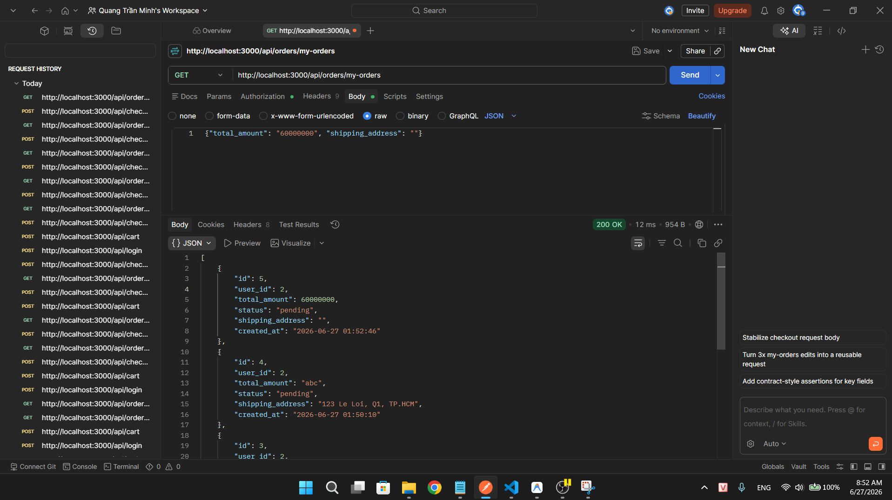
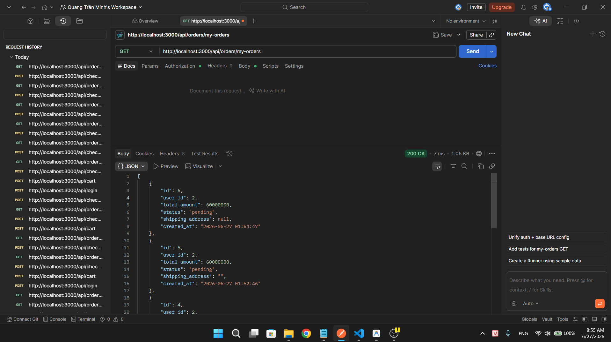

## Found by Test Case

TC-FR08-DT-010, TC-FR08-DT-011

## Requirement liên quan

FR-08: _"Giao diện hiển thị đầy đủ danh sách sản phẩm đặt mua"_ — Đơn hàng cần có địa chỉ giao hàng hợp lệ để có thể giao hàng.

## Severity / Priority

Major / P1

## Environment

- Backend: EShop API — `http://localhost:3000`
- Tool: Postman
- OS: Windows
- Endpoint: `POST /api/checkout`

## Steps to reproduce

**Trường hợp 1 — Rỗng:**

1. Đăng nhập và thêm sản phẩm vào giỏ
2. Gửi `POST /api/checkout` với body: `{"total_amount": 200000, "shipping_address": ""}`
3. Kiểm tra đơn hàng — `shipping_address` = `""` (rỗng)

**Trường hợp 2 — Missing:**

1. Đăng nhập và thêm sản phẩm vào giỏ
2. Gửi `POST /api/checkout` với body: `{"total_amount": 200000}` (không có trường `shipping_address`)
3. Kiểm tra đơn hàng — `shipping_address` = `null`

## Expected result

- Backend từ chối tạo đơn hàng khi `shipping_address` rỗng hoặc thiếu
- Hoặc backend sử dụng địa chỉ mặc định từ hồ sơ cá nhân (FR-04)

## Actual result

- Checkout thành công (HTTP 200 OK) trong cả hai trường hợp
- Đơn hàng được tạo với `shipping_address` = `""` hoặc `null`
- Đơn hàng không có địa chỉ giao hàng → không thể thực hiện giao hàng

## Evidence

TC-FR08-DT-010

TC-FR08-DT-011

