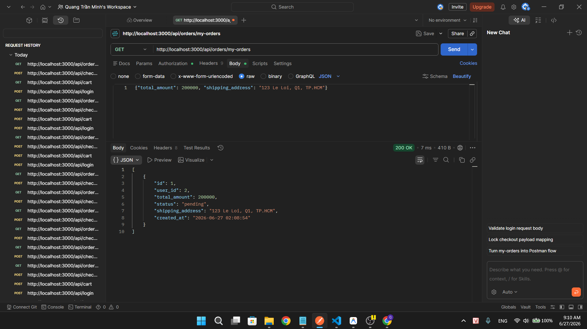

## Found by Test Case

TC-FR08-DT-014

## Requirement liên quan

FR-08: Checkout yêu cầu giỏ hàng có sản phẩm. Tổng tiền được tính từ giỏ hàng.

## Severity / Priority

Major / P1

## Environment

- Backend: EShop API — `http://localhost:3000`
- Tool: Postman
- OS: Windows
- Endpoint: `POST /api/checkout`

## Steps to reproduce

1. Đăng nhập `POST /api/login` với `test@eshop.com` / `Test1234!` → lưu `token`
2. Đảm bảo giỏ hàng trống (gọi `GET /api/cart` để xác nhận)
3. Gửi `POST /api/checkout` với body:
   ```json
   {
     "total_amount": 200000,
     "shipping_address": "123 Le Loi, Q1, TP.HCM"
   }
   ```
   Header: `Authorization: Bearer <token>`
4. Kiểm tra response và danh sách đơn hàng

## Expected result

- Response trả về lỗi (HTTP 400) với thông báo giỏ hàng trống
- Không tạo đơn hàng

## Actual result

- Response trả về HTTP 200 OK
- Đơn hàng được tạo với `total_amount` = 200,000₫ (giá trị client gửi) mặc dù giỏ hàng trống
- Kết hợp với BUG-FR08-001 (backend tin client), hacker có thể tạo đơn hàng phantom với bất kỳ tổng tiền nào mà không cần có sản phẩm trong giỏ

## Evidence

TC-FR08-DT-014

