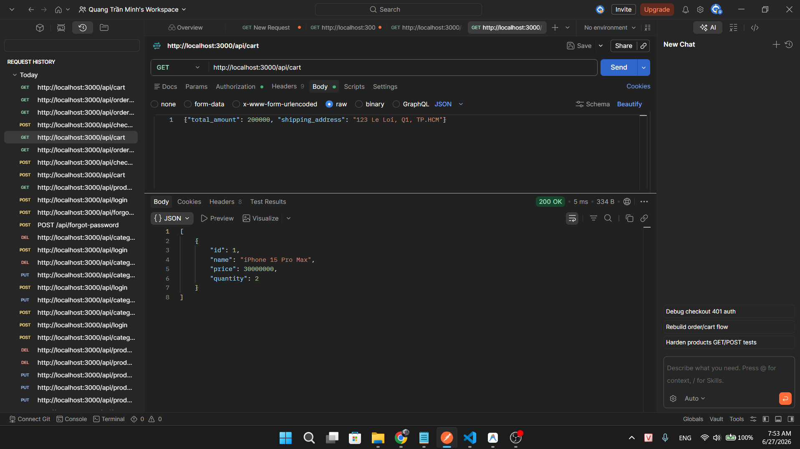
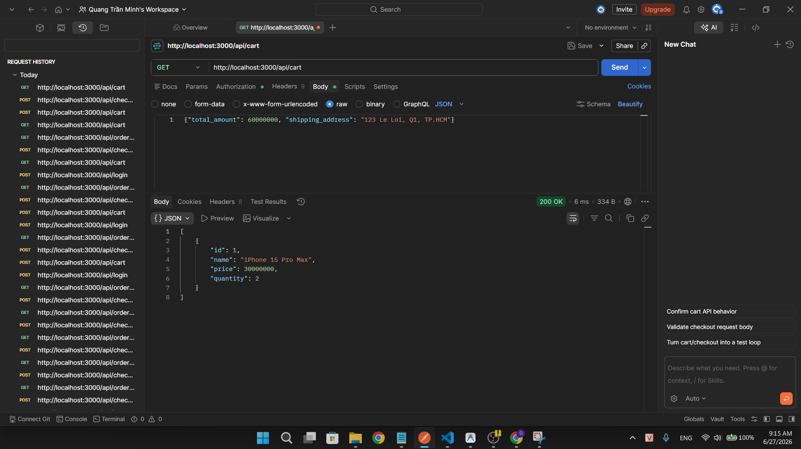

## Found by Test Case

TC-FR08-DT-001, TC-FR08-DT-015

## Requirement liên quan

FR-08: _"Sau thanh toán thành công, giỏ hàng được xóa."_

## Severity / Priority

Major / P1

## Environment

- Backend: EShop API — `http://localhost:3000`
- Tool: Postman
- OS: Windows
- Endpoint: `POST /api/checkout`, `GET /api/cart`

## Steps to reproduce

1. Đăng nhập `POST /api/login` với `test@eshop.com` / `Test1234!` → lưu `token`
2. Thêm sản phẩm vào giỏ `POST /api/cart` với `{"id": 1, "name": "Sản phẩm A", "price": 100000, "quantity": 2}`
3. Gọi `GET /api/cart` → xác nhận giỏ hàng có sản phẩm
4. Gửi `POST /api/checkout` với body hợp lệ → checkout thành công (200 OK)
5. Gọi `GET /api/cart` ngay sau checkout

## Expected result

- Giỏ hàng trống sau checkout thành công
- `GET /api/cart` trả về danh sách rỗng

## Actual result

- Giỏ hàng **vẫn còn sản phẩm** sau checkout thành công
- `GET /api/cart` trả về danh sách sản phẩm giống trước khi checkout
- Người dùng có thể vô tình checkout lại lần nữa, tạo đơn hàng trùng lặp

## Evidence

TC-FR08-DT-001

TC-FR08-DT-015

