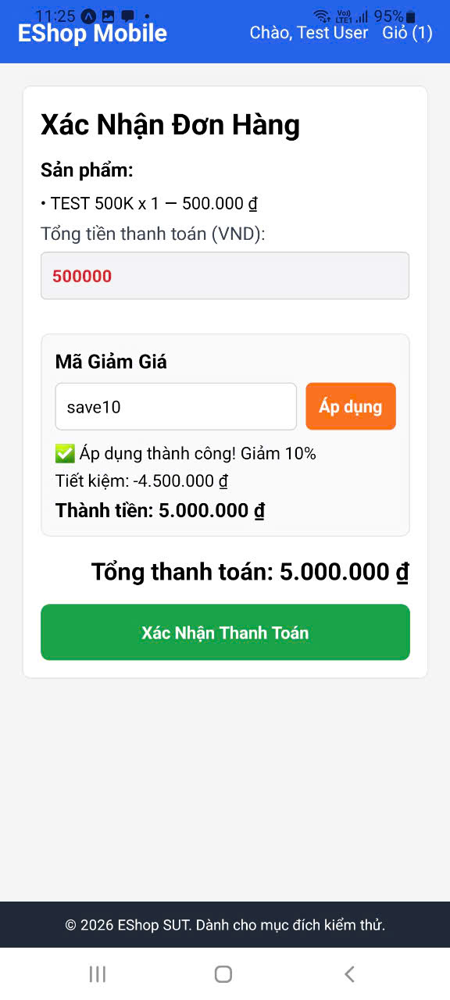
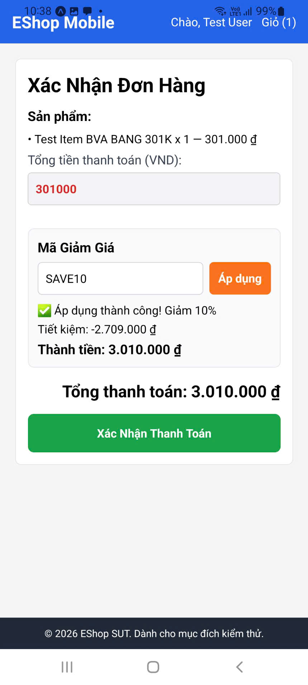
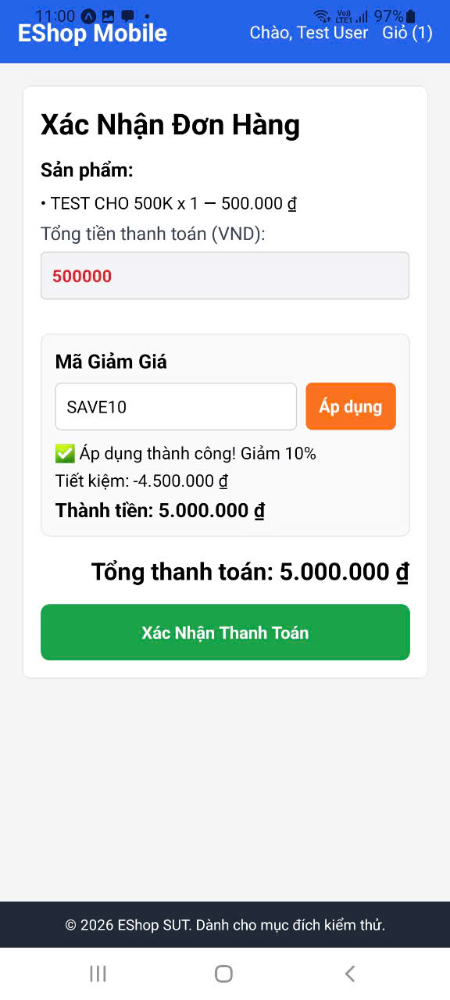

## Found by Test Case

TC-FR09-DT-001, TC-FR09-DT-010, TC-FR09-BVA-003, TC-FR09-BVA-010

## Requirement liên quan

FR-09 — Mã Giảm Giá (Coupon)

## Severity / Priority

Critical / P0

## Environment

- **Nền tảng:** Mobile App (React Native + Expo)
- **Backend:** Node.js + Express + SQLite tại `http://localhost:3000`
- **API:** `POST /api/apply-coupon`
- **Mã giảm giá:** SAVE10 (type: percent, discount_value: 10, min_order_amount: 300,000₫)

## Steps to reproduce

1. Mở ứng dụng EShop trên thiết bị di động
2. Đăng nhập với tài khoản test@eshop.com / Test1234!
3. Thêm sản phẩm vào giỏ hàng sao cho tổng giá trị = 500,000₫
4. Chạm vào tab **Giỏ hàng** trên thanh điều hướng dưới cùng
5. Chạm nút **Thanh toán** để chuyển sang màn hình Checkout
6. Chạm vào ô nhập **Mã giảm giá**
7. Nhập "SAVE10" bằng bàn phím ảo
8. Chạm nút **Áp dụng**
9. Quan sát số tiền giảm giá và tổng thanh toán trên màn hình

## Expected result

Theo đặc tả FR-09, công thức tính giảm giá loại `percent`:

```
discount_amount = total × discount_value / 100
discount_amount = 500,000 × 10 / 100 = 50,000₫
final_amount = 500,000 - 50,000 = 450,000₫
```

- Số tiền giảm giá hiển thị: **50,000₫**
- Tổng thanh toán sau giảm: **450,000₫**

## Actual result

- Số tiền giảm giá hiển thị: **5,000,000₫** (sai gấp 100 lần)
- Tổng thanh toán sau giảm bị **tăng lên** thay vì giảm xuống (từ 500,000₫ lên 5,000,000₫)
- Lỗi này xảy ra nhất quán với tất cả mã giảm giá loại `percent` (SAVE10, EXPIRED nếu còn hạn)
- Mã giảm giá loại `fixed` (BIGBUY, VIP100) **không bị ảnh hưởng** — hoạt động đúng

## Root Cause Analysis (Giả thuyết)

Nghi ngờ hệ thống áp dụng sai công thức — có thể đang tính:

```
// Sai: nhân trực tiếp discount_value thay vì chia 100
discount_amount = total × discount_value
// = 500,000 × 10 = 5,000,000₫ (sai!)

// Đúng:
discount_amount = total × discount_value / 100
// = 500,000 × 10 / 100 = 50,000₫ (đúng)
```

## Evidence

TC-FR09-DT-001


TC-FR09-DT-010


TC-FR09-BVA-003


TC-FR09-BVA-010


## Impact

- **Mức độ ảnh hưởng:** Nghiêm trọng — Tất cả mã giảm giá loại percent đều bị tính sai
- **Phạm vi:** Toàn bộ người dùng áp dụng mã giảm giá percent trên Mobile App
- **Hậu quả:** Tổng thanh toán tăng lên thay vì giảm, dẫn đến trải nghiệm người dùng tệ và tiềm ẩn tổn thất tài chính nếu hệ thống ghi nhận giá trị sai
