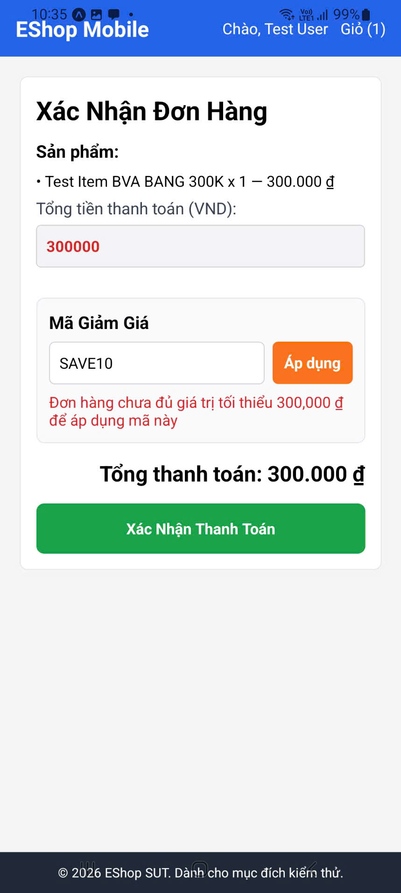
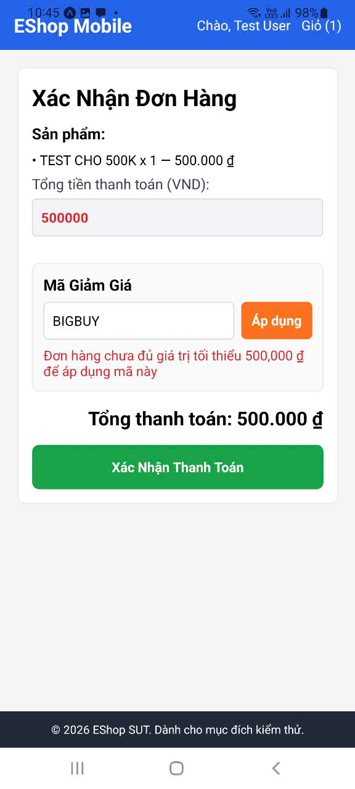

## Found by Test Case

TC-FR09-BVA-002, TC-FR09-BVA-005

## Requirement liên quan

FR-09 — Mã Giảm Giá (Coupon) — Điều kiện C3

## Severity / Priority

Major / P1

## Environment

- **Nền tảng:** Mobile App (React Native + Expo)
- **Backend:** Node.js + Express + SQLite tại `http://localhost:3000`
- **API:** `POST /api/apply-coupon`
- **Mã giảm giá test:** SAVE10 (min_order_amount: 300,000₫), BIGBUY (min_order_amount: 500,000₫)

## Steps to reproduce

**Trường hợp 1 — SAVE10 (ngưỡng 300,000₫):**

1. Mở ứng dụng EShop trên thiết bị di động
2. Đăng nhập với tài khoản test@eshop.com / Test1234!
3. Thêm sản phẩm vào giỏ hàng sao cho tổng giá trị **đúng bằng 300,000₫**
4. Chạm vào tab **Giỏ hàng** → Chạm nút **Thanh toán**
5. Tại màn hình Checkout, chạm vào ô nhập **Mã giảm giá**
6. Nhập "SAVE10" bằng bàn phím ảo → Chạm nút **Áp dụng**
7. Quan sát phản hồi từ hệ thống

**Trường hợp 2 — BIGBUY (ngưỡng 500,000₫):**

1. Lặp lại các bước trên nhưng với tổng giỏ hàng **đúng bằng 500,000₫** và mã "BIGBUY"

## Expected result

Theo đặc tả FR-09 Điều kiện C3:

> **C3: Đủ ngưỡng đơn hàng** — Tổng đơn hàng **>= (lớn hơn hoặc bằng)** `min_order_amount`

- **SAVE10:** total_amount = 300,000₫ **>=** min_order_amount = 300,000₫ → ✅ Phải được chấp nhận
- **BIGBUY:** total_amount = 500,000₫ **>=** min_order_amount = 500,000₫ → ✅ Phải được chấp nhận

Hệ thống phải áp dụng mã giảm giá thành công khi tổng đơn hàng **bằng đúng** ngưỡng tối thiểu.

## Actual result

- **SAVE10 (BVA-002):** Hệ thống hiển thị thông báo lỗi: "Đơn hàng chưa đạt ngưỡng tối thiểu 300,000₫ để sử dụng mã này." → ❌ Từ chối sai
- **BIGBUY (BVA-005):** Hệ thống hiển thị thông báo lỗi tương tự → ❌ Từ chối sai

Hệ thống **từ chối** mã giảm giá khi tổng đơn hàng đúng bằng ngưỡng tối thiểu.

## Root Cause Analysis (Giả thuyết)

Backend đang sử dụng phép so sánh **strictly greater than** (`>`) thay vì **greater than or equal** (`>=`) khi kiểm tra điều kiện C3:

```javascript
// Sai (hiện tại):
if (total_amount > coupon.min_order_amount) { ... }

// Đúng (theo đặc tả):
if (total_amount >= coupon.min_order_amount) { ... }
```

**Bằng chứng hỗ trợ:**

- BVA-001: total = 299,999₫ (< 300,000₫) → ❌ Từ chối → **Đúng**
- BVA-002: total = 300,000₫ (= 300,000₫) → ❌ Từ chối → **Sai** (off-by-one)
- BVA-003: total = 300,001₫ (> 300,000₫) → ✅ Chấp nhận → **Đúng** (nhưng bị bug tính giá)

Pattern tương tự xảy ra với BIGBUY:

- BVA-004: total = 499,999₫ → ❌ Từ chối → **Đúng**
- BVA-005: total = 500,000₫ → ❌ Từ chối → **Sai** (off-by-one)
- BVA-006: total = 500,001₫ → ✅ Chấp nhận → **Đúng**

## Evidence

TC-FR09-BVA-002


TC-FR09-BVA-005


## Impact

- **Mức độ ảnh hưởng:** Quan trọng — Người dùng có tổng đơn hàng đúng bằng ngưỡng tối thiểu không thể sử dụng mã giảm giá
- **Phạm vi:** Tất cả mã giảm giá có `min_order_amount > 0` trên mọi nền tảng (nếu cùng backend)
- **Hậu quả:** Vi phạm trực tiếp đặc tả FR-09 C3, ảnh hưởng trải nghiệm người dùng — đặc biệt khi đơn hàng đúng bằng ngưỡng tối thiểu
