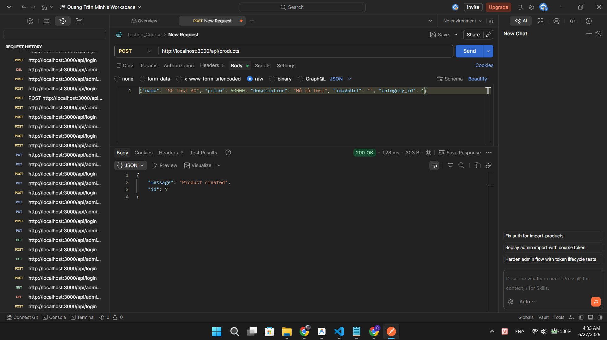
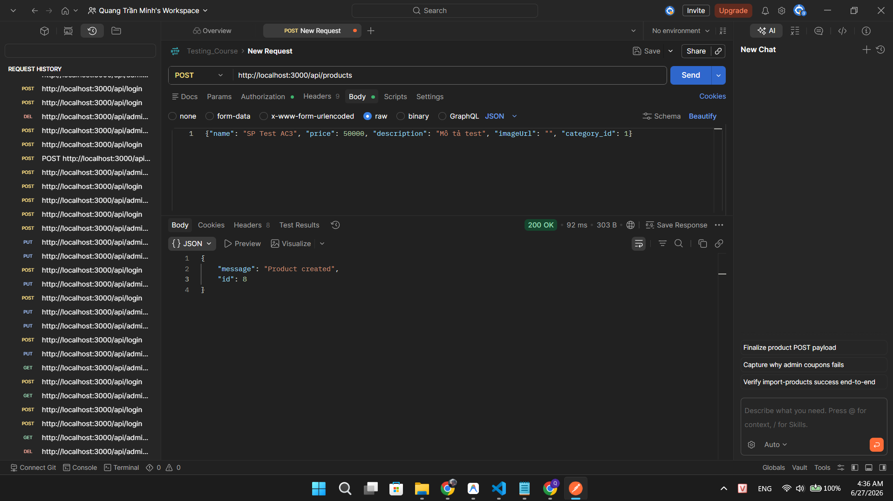
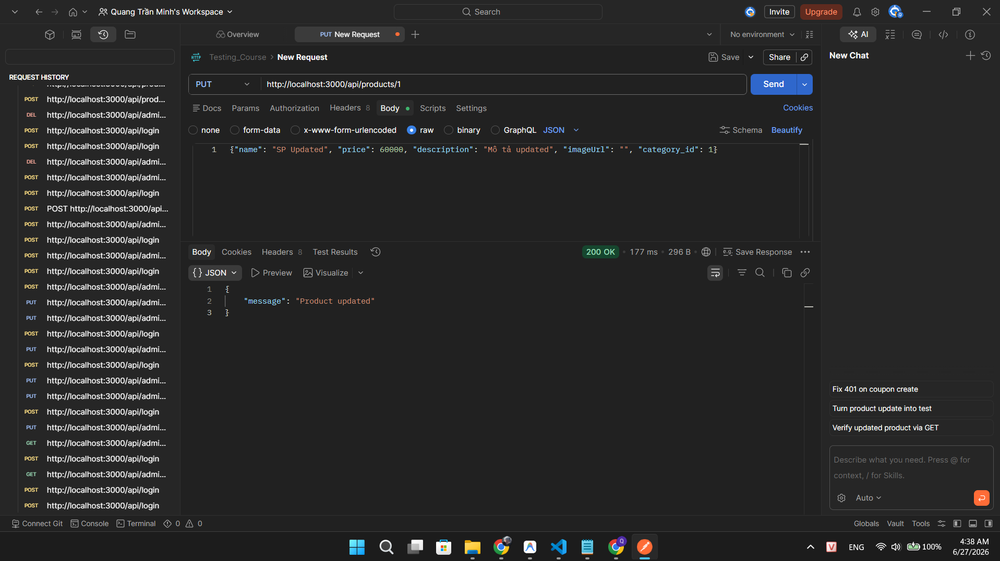
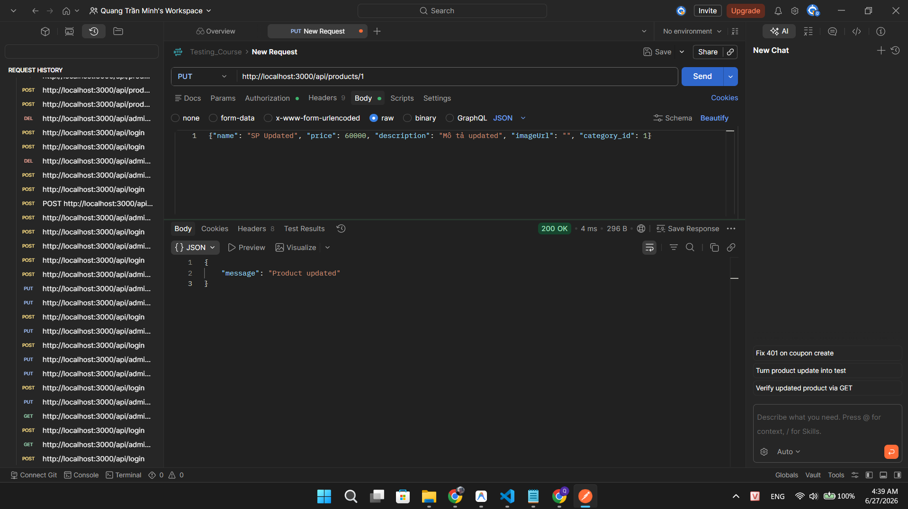
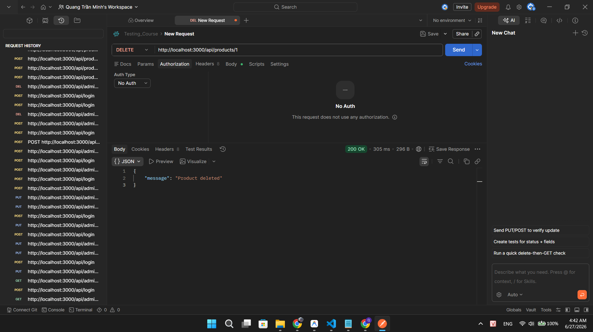
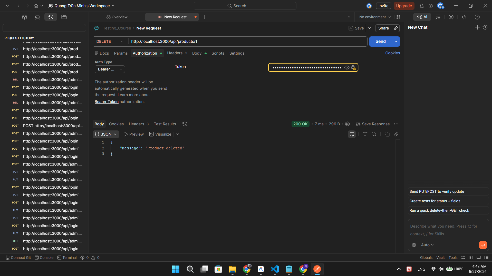

## Found by Test Case

TC-FR12-DT-023, TC-FR12-DT-024, TC-FR12-DT-026, TC-FR12-DT-027, TC-FR12-DT-029, TC-FR12-DT-030

## Requirement liên quan

FR-12, SEC-02, SEC-03

## Severity / Priority

Critical / P0

## Environment

- API Tool: Postman / cURL
- OS: Windows
- Backend: http://localhost:3000

## Steps to reproduce

1. Mở công cụ API testing (Postman hoặc cURL)
2. Tạo request POST đến `http://localhost:3000/api/products`
3. KHÔNG thêm header `Authorization`
4. Thêm body JSON: `{"name": "SP Test AC", "price": 50000, "description": "Mô tả test", "imageUrl": "", "category_id": 1}`
5. Gửi request
6. Quan sát response

## Expected result

Hệ thống trả về HTTP 401 Unauthorized. Không cho phép tạo sản phẩm khi chưa xác thực. Theo FR-12 và SEC-02, các API có tính ảnh hưởng dữ liệu (`POST/PUT/DELETE /api/products`) phải yêu cầu JWT Token hợp lệ.

## Actual result

Hệ thống trả về HTTP 200 OK. Sản phẩm được tạo thành công mà KHÔNG cần Token. Các endpoint `POST /api/products`, `PUT /api/products/:id`, `DELETE /api/products/:id` hoàn toàn không có middleware xác thực — bất kỳ ai cũng có thể thêm/sửa/xóa sản phẩm mà không cần đăng nhập.

## Evidence

TC-FR12-DT-023

TC-FR12-DT-024

TC-FR12-DT-026

TC-FR12-DT-027

TC-FR12-DT-029

TC-FR12-DT-030

