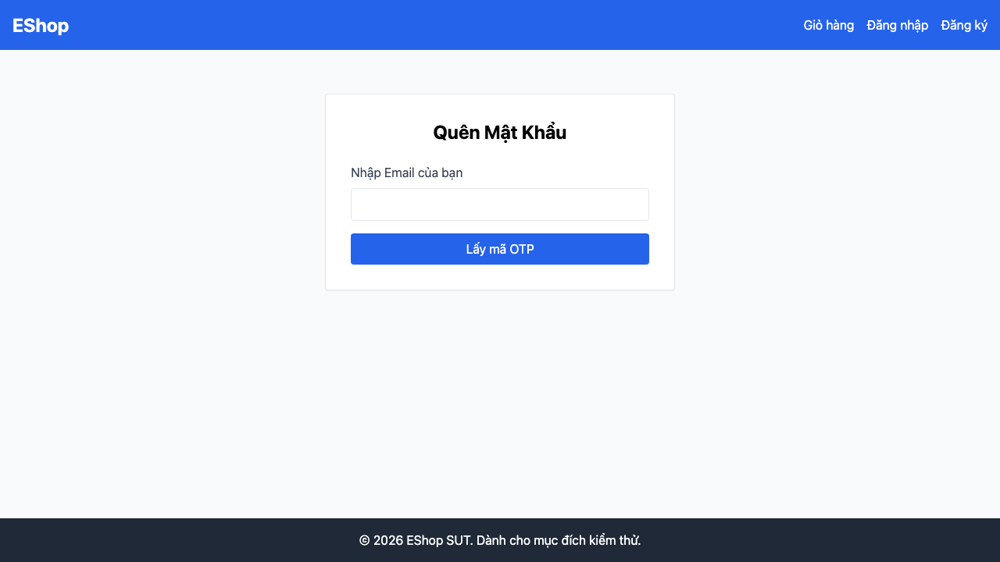

## Found by Test Case
TC-FR03-DT-002

## Requirement liên quan
FR-03: Quên mật khẩu & Đặt lại mật khẩu

## Severity / Priority
Major / P2

## Environment
Browser: Chromium, Firefox, WebKit  
OS: macOS Darwin 25.5.0 arm64  
Frontend URL: http://localhost:5173  
Playwright: 1.62.1  
Build / Commit: `c3adcdd`

## Steps to reproduce
1. Mở trang `/forgot-password`.
2. Tìm nút hoặc liên kết `Quay lại đăng nhập` ngay tại bước nhập email.

## Expected result
Bước nhập email có nút/liên kết quay lại trang đăng nhập và khi bấm sẽ điều hướng về `/login`.

## Actual result
Không tìm thấy nút/liên kết `Quay lại đăng nhập` ở bước nhập email.

## Evidence
- Playwright HTML report: [`reports/html/fr03-forgot-password/chromium/hw04-report.html`](../../reports/html/fr03-forgot-password/chromium/hw04-report.html)
- Cross-browser HTML reports:
  - [`reports/html/fr03-forgot-password/chromium/hw04-report.html`](../../reports/html/fr03-forgot-password/chromium/hw04-report.html)
  - [`reports/html/fr03-forgot-password/firefox/hw04-report.html`](../../reports/html/fr03-forgot-password/firefox/hw04-report.html)
  - [`reports/html/fr03-forgot-password/webkit/hw04-report.html`](../../reports/html/fr03-forgot-password/webkit/hw04-report.html)
- JSON result: [`reports/results/fr03-forgot-password/chromium/results.json`](../../reports/results/fr03-forgot-password/chromium/results.json)
- Screenshot Evidence: [`test-results/fr03-forgot-password/chromium/fr03-forgot-password-Run-b-f3ec7-ại-đăng-nhập-ở-bước-lấy-OTP-chromium/test-failed-1.png`](../../test-results/fr03-forgot-password/chromium/fr03-forgot-password-Run-b-f3ec7-ại-đăng-nhập-ở-bước-lấy-OTP-chromium/test-failed-1.png)

- Error context: [`test-results/fr03-forgot-password/chromium/fr03-forgot-password-Run-b-f3ec7-ại-đăng-nhập-ở-bước-lấy-OTP-chromium/error-context.md`](../../test-results/fr03-forgot-password/chromium/fr03-forgot-password-Run-b-f3ec7-ại-đăng-nhập-ở-bước-lấy-OTP-chromium/error-context.md)

## GitHub Issue
[#215](https://github.com/lmchkhi/CS423-CSC15003-Testing-N08/issues/215)
