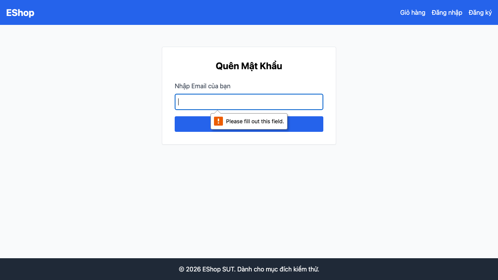
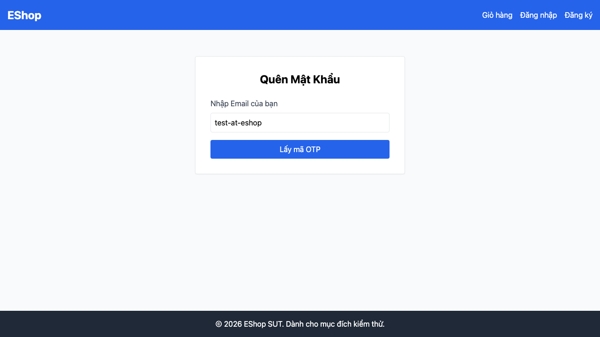
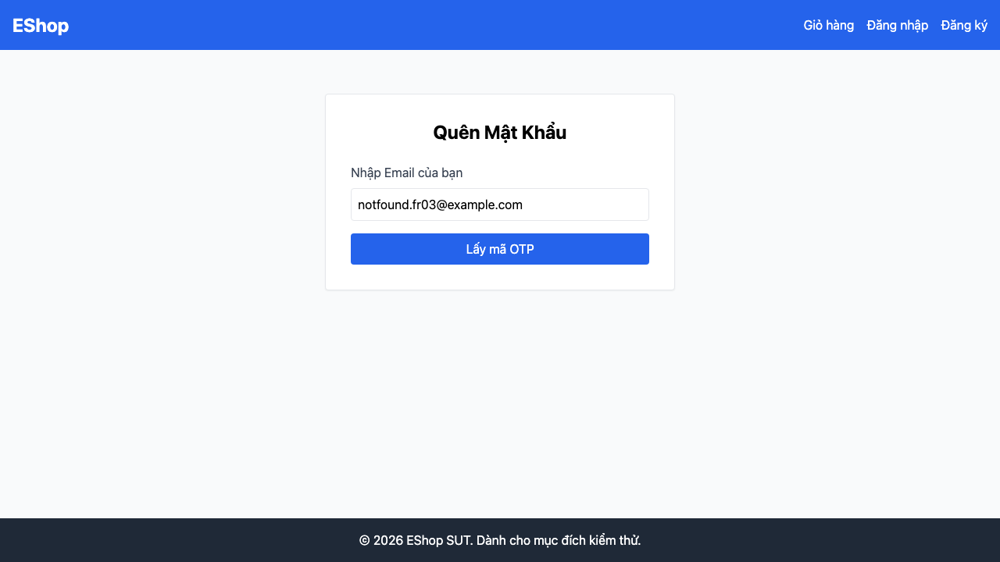

## Found by Test Case
TC-FR03-DT-003, TC-FR03-DT-004, TC-FR03-DT-005

## Requirement liên quan
FR-03: Quên mật khẩu & Đặt lại mật khẩu, GUI-02

## Severity / Priority
Major / P2

## Environment
Browser: Chromium, Firefox, WebKit  
OS: macOS Darwin 25.5.0 arm64  
Frontend URL: http://localhost:5173  
Playwright: 1.62.1  
Build / Commit: `c3adcdd`

## Steps to reproduce
1. Mở trang `/forgot-password`.
2. Bấm `Lấy mã OTP` khi email rỗng.
3. Nhập email sai định dạng, ví dụ `test-at-eshop`, rồi bấm `Lấy mã OTP`.
4. Nhập email chưa đăng ký, ví dụ `notfound.fr03@example.com`, rồi bấm `Lấy mã OTP`.

## Expected result
Hệ thống hiển thị thông báo lỗi phù hợp cho từng input: email bắt buộc, email sai định dạng, hoặc email chưa đăng ký.

## Actual result
Sau khi submit các input trên, UI vẫn chỉ hiển thị form ban đầu và không có thông báo lỗi rõ ràng trong nội dung trang.

## Evidence
- Playwright HTML report: [`reports/html/fr03-forgot-password/chromium/hw04-report.html`](../../reports/html/fr03-forgot-password/chromium/hw04-report.html)
- Cross-browser HTML reports:
  - [`reports/html/fr03-forgot-password/chromium/hw04-report.html`](../../reports/html/fr03-forgot-password/chromium/hw04-report.html)
  - [`reports/html/fr03-forgot-password/firefox/hw04-report.html`](../../reports/html/fr03-forgot-password/firefox/hw04-report.html)
  - [`reports/html/fr03-forgot-password/webkit/hw04-report.html`](../../reports/html/fr03-forgot-password/webkit/hw04-report.html)
- JSON result: [`reports/results/fr03-forgot-password/chromium/results.json`](../../reports/results/fr03-forgot-password/chromium/results.json)
- Screenshot Evidence:
  - [`test-results/fr03-forgot-password/chromium/fr03-forgot-password-Run-b-00c62-03---Lấy-OTP-với-email-rỗng-chromium/test-failed-1.png`](../../test-results/fr03-forgot-password/chromium/fr03-forgot-password-Run-b-00c62-03---Lấy-OTP-với-email-rỗng-chromium/test-failed-1.png)
  - [`test-results/fr03-forgot-password/chromium/fr03-forgot-password-Run-b-b4eea-OTP-với-email-sai-định-dạng-chromium/test-failed-1.png`](../../test-results/fr03-forgot-password/chromium/fr03-forgot-password-Run-b-b4eea-OTP-với-email-sai-định-dạng-chromium/test-failed-1.png)
  - [`test-results/fr03-forgot-password/chromium/fr03-forgot-password-Run-b-35bdc--OTP-với-email-chưa-đăng-ký-chromium/test-failed-1.png`](../../test-results/fr03-forgot-password/chromium/fr03-forgot-password-Run-b-35bdc--OTP-với-email-chưa-đăng-ký-chromium/test-failed-1.png)

- Error context email rỗng: [`test-results/fr03-forgot-password/chromium/fr03-forgot-password-Run-b-00c62-03---Lấy-OTP-với-email-rỗng-chromium/error-context.md`](../../test-results/fr03-forgot-password/chromium/fr03-forgot-password-Run-b-00c62-03---Lấy-OTP-với-email-rỗng-chromium/error-context.md)
- Error context email sai định dạng: [`test-results/fr03-forgot-password/chromium/fr03-forgot-password-Run-b-b4eea-OTP-với-email-sai-định-dạng-chromium/error-context.md`](../../test-results/fr03-forgot-password/chromium/fr03-forgot-password-Run-b-b4eea-OTP-với-email-sai-định-dạng-chromium/error-context.md)
- Error context email chưa đăng ký: [`test-results/fr03-forgot-password/chromium/fr03-forgot-password-Run-b-35bdc--OTP-với-email-chưa-đăng-ký-chromium/error-context.md`](../../test-results/fr03-forgot-password/chromium/fr03-forgot-password-Run-b-35bdc--OTP-với-email-chưa-đăng-ký-chromium/error-context.md)
