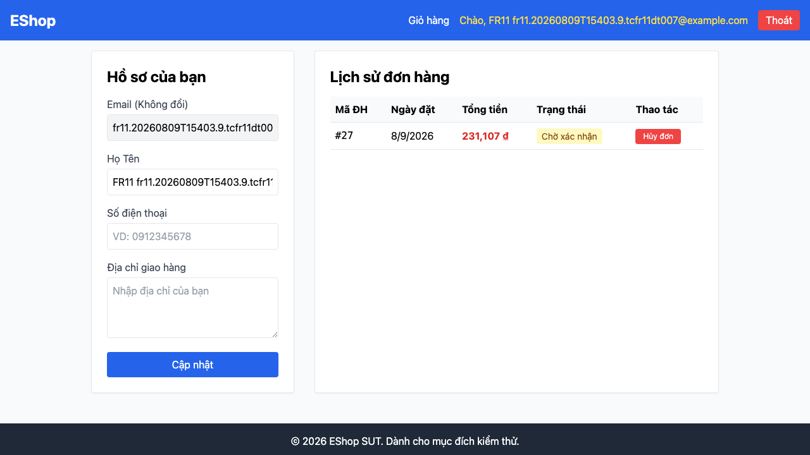

## Found by Test Case
TC-FR11-DT-007

## Requirement liên quan
FR-11: Xem lịch sử đơn hàng (User)

## Severity / Priority
Critical / P1

## Environment
Browser: Chromium  
OS: macOS Darwin 25.5.0 arm64  
Frontend URL: http://[::1]:5173  
API URL: http://[::1]:3000  
Playwright: 1.62.1  
Build / Commit: `c8035a7` + Commit 4 working tree

## Steps to reproduce
1. Tạo và đăng nhập user thường A bằng `POST /api/register` và `POST /api/login`.
2. Tạo một đơn hàng riêng cho user A bằng `POST /api/checkout`.
3. Tạo user thường B và một đơn hàng riêng cho user B bằng API black-box.
4. Mở trang lịch sử đơn hàng của user A để xác nhận UI chỉ hiển thị đơn của user A.
5. Gọi `GET /api/orders/<other_user_order_id>` với Bearer token của user A, trong đó `<other_user_order_id>` là đơn của user B.
6. Quan sát HTTP status và body response.

## Expected result
API phải từ chối truy cập vì đơn hàng không thuộc user đang đăng nhập. Response nên là `401`, `403` hoặc `404`, và không được trả các trường dữ liệu chi tiết như `user_id`, `total_amount`, `shipping_address`, `created_at`.

## Actual result
API trả `200 OK` và body chứa chi tiết đơn hàng của user khác:

```json
{
  "id": 28,
  "user_id": 34,
  "total_amount": 991107,
  "status": "pending",
  "shipping_address": "FR11 DT007 other user protected order #1",
  "created_at": "2026-08-09 15:40:59"
}
```

Trong cùng test run, UI của user A chỉ hiển thị đơn của chính user A (`#27`), nhưng API detail vẫn trả được dữ liệu order `#28` thuộc user B.

## Evidence
- Playwright HTML report: [`reports/html/fr11-order-history/chromium/hw04-report.html`](../../reports/html/fr11-order-history/chromium/hw04-report.html)
- Playwright original report: [`reports/html/fr11-order-history/chromium/index.html`](../../reports/html/fr11-order-history/chromium/index.html)
- JSON result: [`reports/results/fr11-order-history/chromium/results.json`](../../reports/results/fr11-order-history/chromium/results.json)
- Screenshot Evidence: [`test-results/fr11-order-history/chromium/fr11-order-history-Run-by--f84db-tiết-đơn-hàng-của-user-khác-chromium/test-failed-1.png`](../../test-results/fr11-order-history/chromium/fr11-order-history-Run-by--f84db-tiết-đơn-hàng-của-user-khác-chromium/test-failed-1.png)



- Error context: [`test-results/fr11-order-history/chromium/fr11-order-history-Run-by--f84db-tiết-đơn-hàng-của-user-khác-chromium/error-context.md`](../../test-results/fr11-order-history/chromium/fr11-order-history-Run-by--f84db-tiết-đơn-hàng-của-user-khác-chromium/error-context.md)
- Trace: [`test-results/fr11-order-history/chromium/fr11-order-history-Run-by--f84db-tiết-đơn-hàng-của-user-khác-chromium/trace.zip`](../../test-results/fr11-order-history/chromium/fr11-order-history-Run-by--f84db-tiết-đơn-hàng-của-user-khác-chromium/trace.zip)
- Video: [`test-results/fr11-order-history/chromium/fr11-order-history-Run-by--f84db-tiết-đơn-hàng-của-user-khác-chromium/video.webm`](../../test-results/fr11-order-history/chromium/fr11-order-history-Run-by--f84db-tiết-đơn-hàng-của-user-khác-chromium/video.webm)

## GitHub Issue
TODO - sẽ tạo/chốt sau khi hoàn tất FR-11 full suite ở Commit 5 nếu defect vẫn reproduce ổn định.
