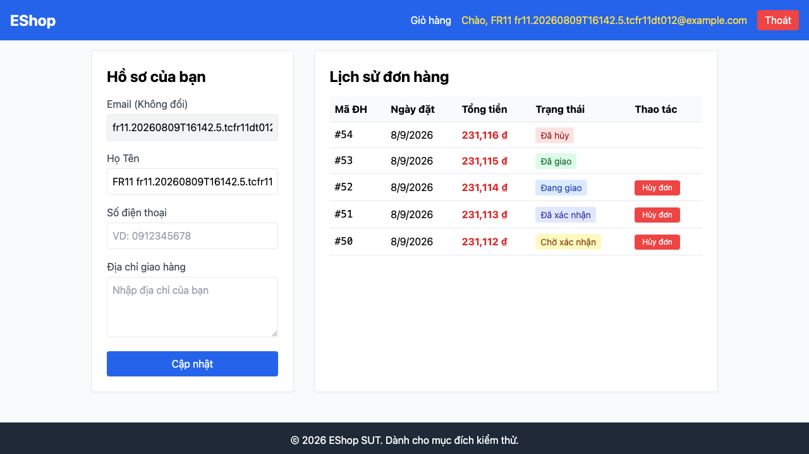
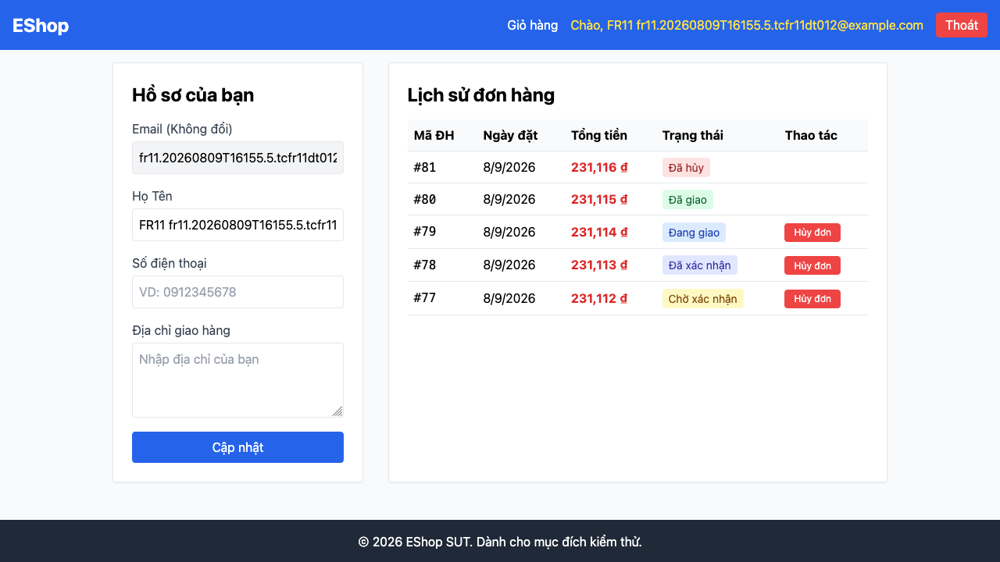
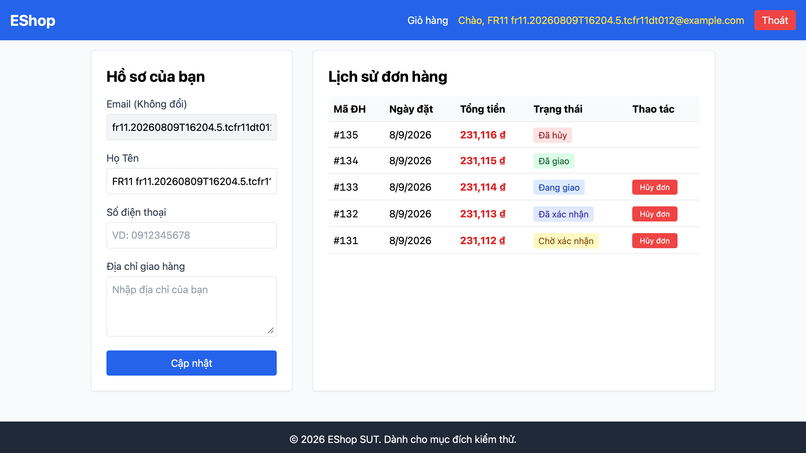

## Found by Test Case
TC-FR11-DT-012

## Requirement liên quan
FR-11: Xem lịch sử đơn hàng (User)

## Severity / Priority
Minor / P3

## Environment
Browser: Chromium, Firefox, WebKit
OS: macOS Darwin 25.5.0 arm64
Frontend URL: http://[::1]:5173
API URL: http://[::1]:3000
Playwright: 1.62.1
Build / Commit: `7a08db4` + Commit 5 working tree

## Steps to reproduce
1. Tạo user thường bằng `POST /api/register` và `POST /api/login`.
2. Tạo 5 đơn hàng cho user bằng `POST /api/checkout`.
3. Dùng quyền admin qua API black-box để chuyển trạng thái các đơn lần lượt thành `pending`, `confirmed`, `shipping`, `delivered`, `canceled`.
4. Đăng nhập user thường trên frontend web.
5. Mở trang lịch sử đơn hàng.
6. Quan sát màu badge/cell trạng thái của đơn `Đã xác nhận` và `Đang giao`.

## Expected result
Các trạng thái đơn hàng phải có màu sắc đủ khác biệt để user dễ quét danh sách và phân biệt nhanh trạng thái. Trong automation, khoảng cách màu tối thiểu giữa `Đã xác nhận` và `Đang giao` được đặt là `>= 80`.

## Actual result
Màu trạng thái `Đã xác nhận` và `Đang giao` quá giống nhau. Automation đo được khoảng cách màu chỉ là `5.916079783099616`, thấp hơn nhiều so với ngưỡng `80`. Lỗi reproduce ổn định trên Chromium, Firefox và WebKit.

## Evidence
- Chromium Playwright HTML report: [`reports/html/fr11-order-history/chromium/hw04-report.html`](../../reports/html/fr11-order-history/chromium/hw04-report.html)
- Chromium original report: [`reports/html/fr11-order-history/chromium/index.html`](../../reports/html/fr11-order-history/chromium/index.html)
- Chromium JSON result: [`reports/results/fr11-order-history/chromium/results.json`](../../reports/results/fr11-order-history/chromium/results.json)
- Chromium Screenshot Evidence: [`test-results/fr11-order-history/chromium/fr11-order-history-Run-by--79ecb--thái-đơn-hàng-bằng-màu-sắc-chromium/test-failed-1.png`](../../test-results/fr11-order-history/chromium/fr11-order-history-Run-by--79ecb--thái-đơn-hàng-bằng-màu-sắc-chromium/test-failed-1.png)

- Chromium error context: [`test-results/fr11-order-history/chromium/fr11-order-history-Run-by--79ecb--thái-đơn-hàng-bằng-màu-sắc-chromium/error-context.md`](../../test-results/fr11-order-history/chromium/fr11-order-history-Run-by--79ecb--thái-đơn-hàng-bằng-màu-sắc-chromium/error-context.md)
- Chromium trace: [`test-results/fr11-order-history/chromium/fr11-order-history-Run-by--79ecb--thái-đơn-hàng-bằng-màu-sắc-chromium/trace.zip`](../../test-results/fr11-order-history/chromium/fr11-order-history-Run-by--79ecb--thái-đơn-hàng-bằng-màu-sắc-chromium/trace.zip)
- Chromium video: [`test-results/fr11-order-history/chromium/fr11-order-history-Run-by--79ecb--thái-đơn-hàng-bằng-màu-sắc-chromium/video.webm`](../../test-results/fr11-order-history/chromium/fr11-order-history-Run-by--79ecb--thái-đơn-hàng-bằng-màu-sắc-chromium/video.webm)

- Firefox Playwright HTML report: [`reports/html/fr11-order-history/firefox/hw04-report.html`](../../reports/html/fr11-order-history/firefox/hw04-report.html)
- Firefox original report: [`reports/html/fr11-order-history/firefox/index.html`](../../reports/html/fr11-order-history/firefox/index.html)
- Firefox JSON result: [`reports/results/fr11-order-history/firefox/results.json`](../../reports/results/fr11-order-history/firefox/results.json)
- Firefox Screenshot Evidence: [`test-results/fr11-order-history/firefox/fr11-order-history-Run-by--79ecb--thái-đơn-hàng-bằng-màu-sắc-firefox/test-failed-1.png`](../../test-results/fr11-order-history/firefox/fr11-order-history-Run-by--79ecb--thái-đơn-hàng-bằng-màu-sắc-firefox/test-failed-1.png)

- Firefox error context: [`test-results/fr11-order-history/firefox/fr11-order-history-Run-by--79ecb--thái-đơn-hàng-bằng-màu-sắc-firefox/error-context.md`](../../test-results/fr11-order-history/firefox/fr11-order-history-Run-by--79ecb--thái-đơn-hàng-bằng-màu-sắc-firefox/error-context.md)
- Firefox trace: [`test-results/fr11-order-history/firefox/fr11-order-history-Run-by--79ecb--thái-đơn-hàng-bằng-màu-sắc-firefox/trace.zip`](../../test-results/fr11-order-history/firefox/fr11-order-history-Run-by--79ecb--thái-đơn-hàng-bằng-màu-sắc-firefox/trace.zip)
- Firefox video: [`test-results/fr11-order-history/firefox/fr11-order-history-Run-by--79ecb--thái-đơn-hàng-bằng-màu-sắc-firefox/video.webm`](../../test-results/fr11-order-history/firefox/fr11-order-history-Run-by--79ecb--thái-đơn-hàng-bằng-màu-sắc-firefox/video.webm)

- WebKit Playwright HTML report: [`reports/html/fr11-order-history/webkit/hw04-report.html`](../../reports/html/fr11-order-history/webkit/hw04-report.html)
- WebKit original report: [`reports/html/fr11-order-history/webkit/index.html`](../../reports/html/fr11-order-history/webkit/index.html)
- WebKit JSON result: [`reports/results/fr11-order-history/webkit/results.json`](../../reports/results/fr11-order-history/webkit/results.json)
- WebKit Screenshot Evidence: [`test-results/fr11-order-history/webkit/fr11-order-history-Run-by--79ecb--thái-đơn-hàng-bằng-màu-sắc-webkit/test-failed-1.png`](../../test-results/fr11-order-history/webkit/fr11-order-history-Run-by--79ecb--thái-đơn-hàng-bằng-màu-sắc-webkit/test-failed-1.png)

- WebKit error context: [`test-results/fr11-order-history/webkit/fr11-order-history-Run-by--79ecb--thái-đơn-hàng-bằng-màu-sắc-webkit/error-context.md`](../../test-results/fr11-order-history/webkit/fr11-order-history-Run-by--79ecb--thái-đơn-hàng-bằng-màu-sắc-webkit/error-context.md)
- WebKit trace: [`test-results/fr11-order-history/webkit/fr11-order-history-Run-by--79ecb--thái-đơn-hàng-bằng-màu-sắc-webkit/trace.zip`](../../test-results/fr11-order-history/webkit/fr11-order-history-Run-by--79ecb--thái-đơn-hàng-bằng-màu-sắc-webkit/trace.zip)
- WebKit video: [`test-results/fr11-order-history/webkit/fr11-order-history-Run-by--79ecb--thái-đơn-hàng-bằng-màu-sắc-webkit/video.webm`](../../test-results/fr11-order-history/webkit/fr11-order-history-Run-by--79ecb--thái-đơn-hàng-bằng-màu-sắc-webkit/video.webm)

## GitHub Issue
[#240](https://github.com/lmchkhi/CS423-CSC15003-Testing-N08/issues/240)
