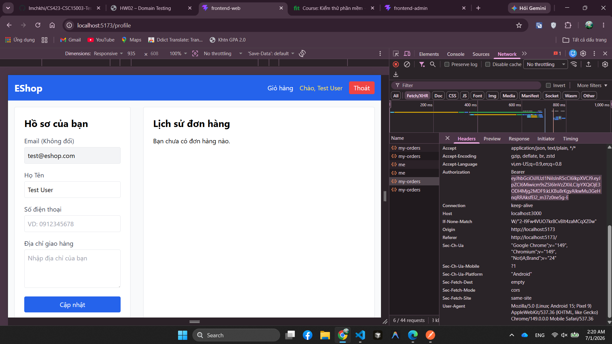
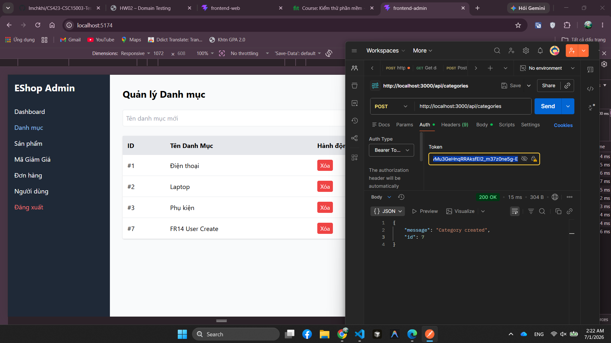
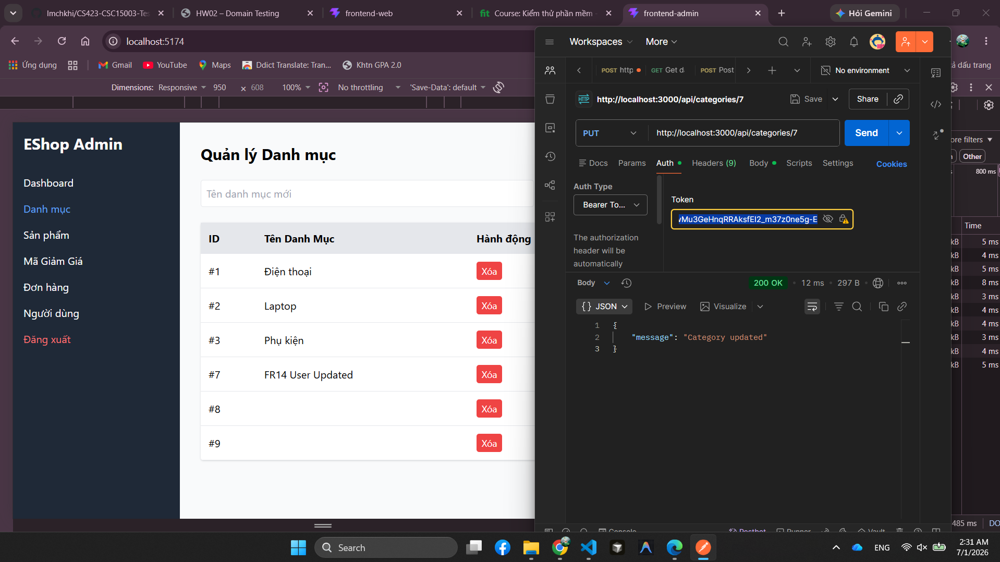

## Found by Test Case
TC-FR14-DT-005, TC-FR14-DT-013, TC-FR14-DT-016

## Requirement liên quan
FR-14: Quản lý Danh mục (Category CRUD)

## Severity / Priority
Critical / P1

## Environment
Browser: Chromium, Firefox, WebKit
OS: macOS Darwin 25.5.0 arm64
Admin URL: http://[::1]:5174
API URL: http://[::1]:3000
Playwright: 1.62.1
Build / Commit: `9eedea6` + Commit 8 working tree

## Steps to reproduce
1. Tạo user thường bằng `POST /api/register`.
2. Đăng nhập user thường bằng `POST /api/login` để lấy JWT có role `user`.
3. Gọi `POST /api/categories` với Bearer token của user thường và body có tên danh mục hợp lệ.
4. Tạo một danh mục test bằng admin token, sau đó gọi `PUT /api/categories/<category_id>` với user token.
5. Tạo một danh mục test khác bằng admin token, sau đó gọi `DELETE /api/categories/<category_id>` với user token.
6. Gọi `GET /api/categories` sau mỗi request để kiểm tra dữ liệu có bị tạo/sửa/xóa không.

## Expected result
API phải từ chối mọi request ảnh hưởng dữ liệu category khi token không có `role = 'admin'`. Response nên là `401` hoặc `403`; danh mục không được tạo, không được đổi tên và không được xóa.

## Actual result
API trả `200 OK` và báo thành công cho cả ba thao tác bằng user token:

- `POST /api/categories` trả body dạng `{"message":"Category created","id":...}` và danh mục mới xuất hiện trong `GET /api/categories`.
- `PUT /api/categories/<category_id>` trả `{"message":"Category updated"}`; tên cũ không còn được giữ và category bị đổi sang tên user gửi.
- `DELETE /api/categories/<category_id>` trả `{"message":"Category deleted"}`; category test không còn trong danh sách.

Automation đã cleanup dữ liệu test sau khi ghi nhận evidence, nên danh sách quay lại các danh mục mặc định.

## Evidence
- Playwright HTML report: [`reports/html/fr14-category-management/chromium/hw04-report.html`](../../reports/html/fr14-category-management/chromium/hw04-report.html)
- Playwright HTML report Firefox: [`reports/html/fr14-category-management/firefox/hw04-report.html`](../../reports/html/fr14-category-management/firefox/hw04-report.html)
- Playwright HTML report WebKit: [`reports/html/fr14-category-management/webkit/hw04-report.html`](../../reports/html/fr14-category-management/webkit/hw04-report.html)
- Playwright original report: [`reports/html/fr14-category-management/chromium/index.html`](../../reports/html/fr14-category-management/chromium/index.html)
- JSON result: [`reports/results/fr14-category-management/chromium/results.json`](../../reports/results/fr14-category-management/chromium/results.json)

- Tester observation: dùng token user thường vẫn thêm, cập nhật và xóa category được.

[`../screenshots/BUG-FR14-001-1.png`](../screenshots/BUG-FR14-001-1.png)

- API verification: `POST /api/categories` với token `role = user` trả `200 OK`, `Category created`, id tạm `7`.

[`../screenshots/BUG-FR14-001-2.png`](../screenshots/BUG-FR14-001-2.png)

- API verification: `PUT /api/categories/7` với token `role = user` trả `200 OK`, `Category updated`.

[`../screenshots/BUG-FR14-001-3.png`](../screenshots/BUG-FR14-001-3.png)

- API verification: `DELETE /api/categories/8` với token `role = user` trả `200 OK`, `Category deleted`.

[`../screenshots/BUG-FR14-001-4.png`](../screenshots/BUG-FR14-001-4.png)

- Dữ liệu tạm tạo trong lúc kiểm tra đã được dọn; danh sách category quay về 3 category mặc định.

- Error context: [`test-results/fr14-category-management/chromium/fr14-category-management-R-c1020--được-thêm-danh-mục-qua-API-chromium/error-context.md`](../../test-results/fr14-category-management/chromium/fr14-category-management-R-c1020--được-thêm-danh-mục-qua-API-chromium/error-context.md)
- Error context TC-FR14-DT-013: [`test-results/fr14-category-management/chromium/fr14-category-management-R-65aca-c-cập-nhật-danh-mục-qua-API-chromium/error-context.md`](../../test-results/fr14-category-management/chromium/fr14-category-management-R-65aca-c-cập-nhật-danh-mục-qua-API-chromium/error-context.md)
- Error context TC-FR14-DT-016: [`test-results/fr14-category-management/chromium/fr14-category-management-R-474bf-g-được-xóa-danh-mục-qua-API-chromium/error-context.md`](../../test-results/fr14-category-management/chromium/fr14-category-management-R-474bf-g-được-xóa-danh-mục-qua-API-chromium/error-context.md)
- Trace: [`test-results/fr14-category-management/chromium/fr14-category-management-R-c1020--được-thêm-danh-mục-qua-API-chromium/trace.zip`](../../test-results/fr14-category-management/chromium/fr14-category-management-R-c1020--được-thêm-danh-mục-qua-API-chromium/trace.zip)
- Video: [`test-results/fr14-category-management/chromium/fr14-category-management-R-c1020--được-thêm-danh-mục-qua-API-chromium/video.webm`](../../test-results/fr14-category-management/chromium/fr14-category-management-R-c1020--được-thêm-danh-mục-qua-API-chromium/video.webm)

## GitHub Issue
[#241](https://github.com/lmchkhi/CS423-CSC15003-Testing-N08/issues/241)
