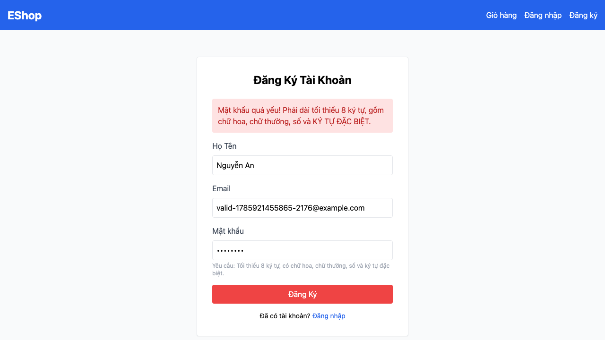

# [BUG][Registration] Mật khẩu hợp lệ theo FR-01 bị từ chối

## Found by Test Case

TC-REG-001

## Requirement liên quan

FR-01

## Severity / Priority

Major / P1

## Environment

- Browser: Chromium 151.0.7922.34, Firefox 153.0, WebKit 26.5
- OS: macOS 26.5.2 (25F84)
- URL: `http://127.0.0.1:5173/register`
- Build/commit: `fc8cc4d0eb3263440e9e5b3c4fc2d076aea08b5c`
- Run timestamps: Chromium `2026-08-08T03:08:07Z`; Firefox `2026-08-08T02:59:44Z`; WebKit `2026-08-08T03:00:34Z`

## Steps to reproduce

1. Mở trang Đăng ký.
2. Nhập Họ Tên và email duy nhất hợp lệ.
3. Nhập `Valid1!a` cho Mật khẩu (và Xác nhận mật khẩu nếu có), rồi bấm Đăng Ký.

## Expected result

Mật khẩu 8 ký tự có chữ hoa, chữ thường, chữ số và ký tự đặc biệt `!` được chấp nhận; người dùng được chuyển tới trang Đăng nhập.

## Actual result

Trang vẫn ở `/register` và báo mật khẩu yếu. Cùng kết quả trên cả ba browser. Regex hiện tại đòi khoảng trắng và chỉ cho phép chữ, số, khoảng trắng thay vì tập `@ $ ! % * ? &`.

## Evidence

- Current Chromium HTML report: [open report](../../reports/account-registration/chromium/index.html)
- The current run reproduced the same failure on Chromium, Firefox, and WebKit.

## GitHub Issue

Duplicate verified and reused: https://github.com/lmchkhi/CS423-CSC15003-Testing-N08/issues/2
