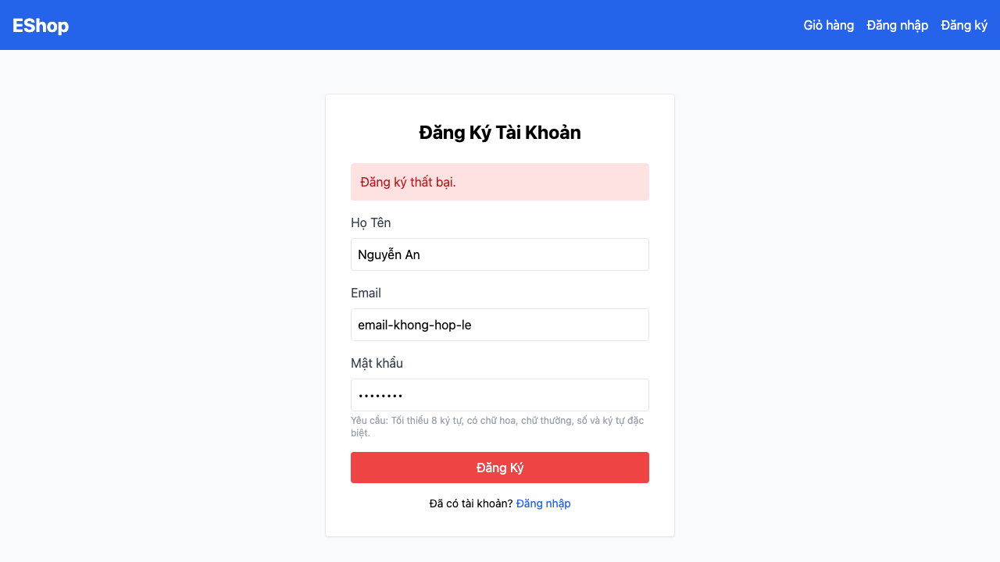

# [BUG][Registration] Hệ thống chấp nhận email sai định dạng

## Found by Test Case

TC-REG-006 (liên quan TC-REG-005)

## Requirement liên quan

FR-01

## Severity / Priority

Major / P1

## Environment

- Browser: Chromium 151.0.7922.34, Firefox 153.0, WebKit 26.5
- OS: macOS 26.5.2 (25F84)
- URLs: `http://127.0.0.1:5173/register`, `http://127.0.0.1:3000/api/register`
- Build/commit: `fc8cc4d0eb3263440e9e5b3c4fc2d076aea08b5c`
- Run timestamps: Chromium `2026-08-08T03:08:07Z`; Firefox `2026-08-08T02:59:44Z`; WebKit `2026-08-08T03:00:34Z`

## Steps to reproduce

1. Mở trang Đăng ký và kiểm tra thuộc tính `type` của trường Email.
2. Nhập Họ Tên, email `email-khong-hop-le` và mật khẩu hợp lệ theo FR-01.
3. Kiểm tra HTML5 email validity và theo dõi xem form có gửi `POST /api/register` hay không.
4. Để xác minh lớp backend độc lập, gửi trực tiếp cùng email sai định dạng tới `POST /api/register`.

## Expected result

Frontend hoặc backend từ chối email không có định dạng `user@domain.com`; API không tạo tài khoản.

## Actual result

Trường Email dùng `type="text"`, nên browser không cung cấp email-format validation. Lần xác minh backend độc lập trả HTTP 200 và tạo tài khoản với email sai định dạng. Run Playwright hiện tại tái hiện lỗi `type="text"` trên cả ba browser.

## Evidence

- Current Chromium HTML report: [open report](../../reports/account-registration/chromium/index.html)
- The embedded screenshot records the initial end-to-end reproduction; the current report records the corrected `type="email"` assertion failing before submission.

## GitHub Issue

Duplicate verified and reused: https://github.com/lmchkhi/CS423-CSC15003-Testing-N08/issues/3
