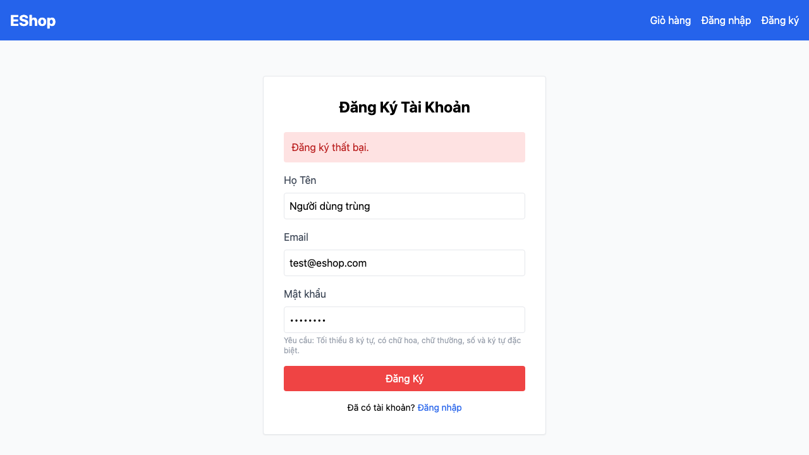

# [BUG][Registration] Hệ thống cho phép đăng ký trùng email

## Found by Test Case

TC-REG-007

## Requirement liên quan

FR-01

## Severity / Priority

Major / P1

## Environment

- Browser: Chromium 151.0.7922.34, Firefox 153.0, WebKit 26.5
- OS: macOS 26.5.2 (25F84)
- URL: `http://127.0.0.1:5175/register`
- Build/commit: `a934bf2d7871413aae4b6d46f820995e04170595`
- Run timestamp: `2026-08-05T09:16:18Z`

## Steps to reproduce

1. Xác nhận tài khoản seed `test@eshop.com` đã tồn tại.
2. Mở trang Đăng ký, nhập lại email `test@eshop.com` cùng các trường còn lại.
3. Bấm Đăng Ký và quan sát response `POST /api/register`.

## Expected result

API từ chối email đã tồn tại, không tạo thêm bản ghi và giao diện hiển thị lỗi.

## Actual result

API trả HTTP 200, tạo thêm người dùng có cùng email và giao diện chuyển tới `/login`. Kết quả lặp lại trên cả ba browser; schema không có ràng buộc UNIQUE cho `users.email`.

## Evidence

## GitHub Issue

Duplicate verified and reused: https://github.com/lmchkhi/CS423-CSC15003-Testing-N08/issues/7
