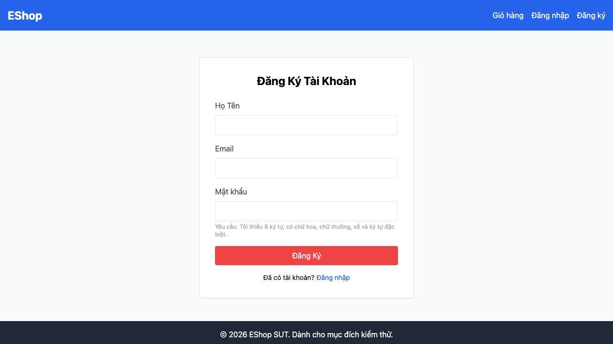

# [BUG][Registration] Form đăng ký thiếu trường Xác nhận mật khẩu

## Found by Test Case

TC-REG-014 (liên quan TC-REG-015)

## Requirement liên quan

FR-01

## Severity / Priority

Major / P1

## Environment

- Browser: Chromium 151.0.7922.34, Firefox 153.0, WebKit 26.5
- OS: macOS 26.5.2 (25F84)
- URL: `http://127.0.0.1:5175/register`
- Build/commit: `a934bf2d7871413aae4b6d46f820995e04170595`
- Run timestamp: `2026-08-05T09:16:18Z`

## Steps to reproduce

1. Mở trang Đăng ký.
2. Quan sát các trường nhập liệu trong form.
3. Tìm trường Xác nhận mật khẩu và thử đăng ký với hai mật khẩu không khớp.

## Expected result

Form có trường Xác nhận mật khẩu bắt buộc và hệ thống từ chối khi giá trị không khớp Mật khẩu.

## Actual result

Form không có trường Xác nhận mật khẩu nên người dùng không thể nhập giá trị xác nhận và hệ thống không thể đối chiếu. Kết quả giống nhau trên cả ba browser.

## Evidence

## GitHub Issue

Duplicate verified and reused: https://github.com/lmchkhi/CS423-CSC15003-Testing-N08/issues/8
