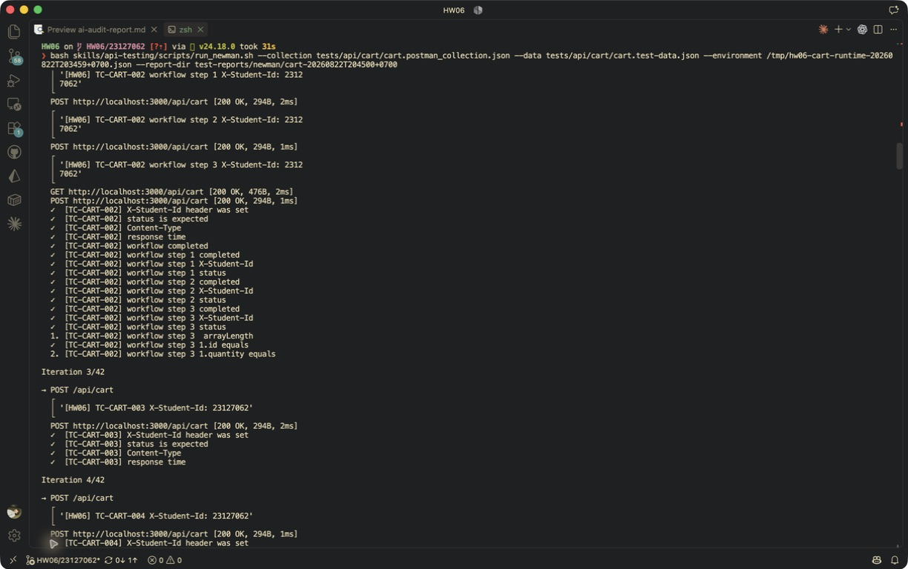

# [BUG][Shopping Cart] Thêm lại cùng sản phẩm tạo dòng trùng thay vì cộng dồn quantity

## Found by Test Case
TC-CART-002

## Also detected by
- Minimal reproduction attempt 1 và 2

## Requirement liên quan
FR-07: thêm cùng một sản phẩm vào giỏ phải tăng số lượng, không tạo dòng mới.

## Severity / Priority
Major / P1

## Environment
- Base URL: `http://localhost:3000`
- Endpoint: `POST /api/cart`
- Commit/build: `4fce82f5c3730a305e4c1e9838b77424bb9a8897`
- Executed at: `2026-08-22T20:45:00+07:00` (Asia/Ho_Chi_Minh)
- Student ID header: `23127062`

## Steps to reproduce
1. Đăng nhập user và lấy JWT hợp lệ.
2. Gửi `POST /api/cart` với một `id` mới và `quantity: 1`.
3. Gửi lại cùng `id` với `quantity: 2`.
4. Gọi `GET /api/cart` bằng cùng JWT.

## Expected result
Giỏ chỉ có một dòng cho `id` vừa thêm và `quantity` của dòng đó bằng `3`.

## Actual result
Hai POST đều trả HTTP 200 nhưng giỏ có hai dòng cùng `id`, với `quantity` lần lượt là `1` và `2`.

## Evidence
- Screenshot: 
- Raw response/log: [duplicate-product evidence](../../test-reports/evidence/cart/duplicate-product/response-or-log.txt)
- Newman report: [HTML](../../test-reports/newman/cart-20260822T204500+0700/newman-report.html)

## Reproducibility
2/2 minimal attempts, ngoài lần phát hiện trong Newman.

## Duplicate check
- Query: `Module: Shopping Cart`, `cùng sản phẩm`, `cart duplicate quantity`, cả open và closed issues.
- Result: Existing issue [#151](https://github.com/lmchkhi/CS423-CSC15003-Testing-N08/issues/151).
