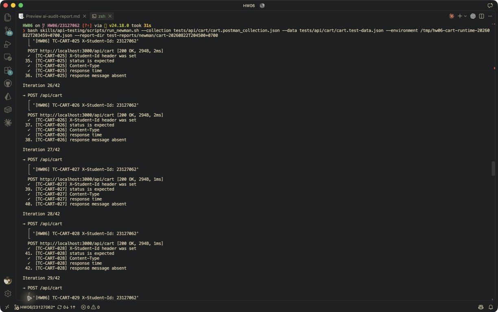

# [BUG][Shopping Cart API] POST /api/cart chấp nhận quantity không phải số nguyên dương

## Found by Test Case
TC-CART-027

## Also detected by
- TC-CART-025
- TC-CART-026
- TC-CART-028
- TC-CART-029
- TC-CART-030
- TC-CART-031
- TC-CART-EXT-001

## Requirement liên quan
FR-06: quantity chỉ nhận số nguyên dương, tối thiểu là 1; FR-07: giỏ hàng quản lý số lượng sản phẩm.

## Severity / Priority
Major / P1

## Environment
- Base URL: `http://localhost:3000`
- Endpoint: `POST /api/cart`
- Commit/build: `4fce82f5c3730a305e4c1e9838b77424bb9a8897`
- Executed at: `2026-08-22T20:45:00+07:00` (Asia/Ho_Chi_Minh)
- Student ID header: `23127062`

## Steps to reproduce
1. Đăng nhập user và lấy JWT hợp lệ.
2. Gửi `POST /api/cart` với cart item hợp lệ ngoại trừ `quantity: 0`.
3. Gọi `GET /api/cart` bằng cùng JWT.

## Expected result
API trả controlled 4xx và không lưu item vì `quantity` nhỏ hơn biên tối thiểu 1.

## Actual result
API trả HTTP 200 với `{"message":"Added to cart"}`; `GET /api/cart` xác nhận item `quantity: 0` đã được lưu. Missing, null, negative, decimal, string và array quantity cũng đều nhận HTTP 200.

## Evidence
- Screenshot: 
- Raw response/log: [invalid quantity evidence](../../test-reports/evidence/cart/invalid-quantity/response-or-log.txt)
- Newman report: [HTML](../../test-reports/newman/cart-20260822T204500+0700/newman-report.html)

## Reproducibility
2/2 minimal attempts với `quantity: 0`, ngoài 7 partitions trong Newman.

## Regression run 20260823T103442+0700
- TC-CART-025–031 và TC-CART-EXT-001 tiếp tục fail do API chấp nhận quantity không hợp lệ.
- Minimal reproduction trả HTTP `200`; `GET /api/cart` xác nhận item `quantity: 0` đã được lưu, vi phạm cả validation và atomicity.
- Evidence: [extension reproduction](../../test-reports/evidence/cart/extension-reproduction-20260823T103442+0700.txt)
- Newman report: [HTML](../../test-reports/newman/cart-20260823T103442+0700/newman-report.html)

## Duplicate check
- Query: `/api/cart`, `quantity=0 cart`, label `Module: Shopping Cart`, cả open và closed issues.
- Result: No duplicate found; published as [issue #285](https://github.com/lmchkhi/CS423-CSC15003-Testing-N08/issues/285).
