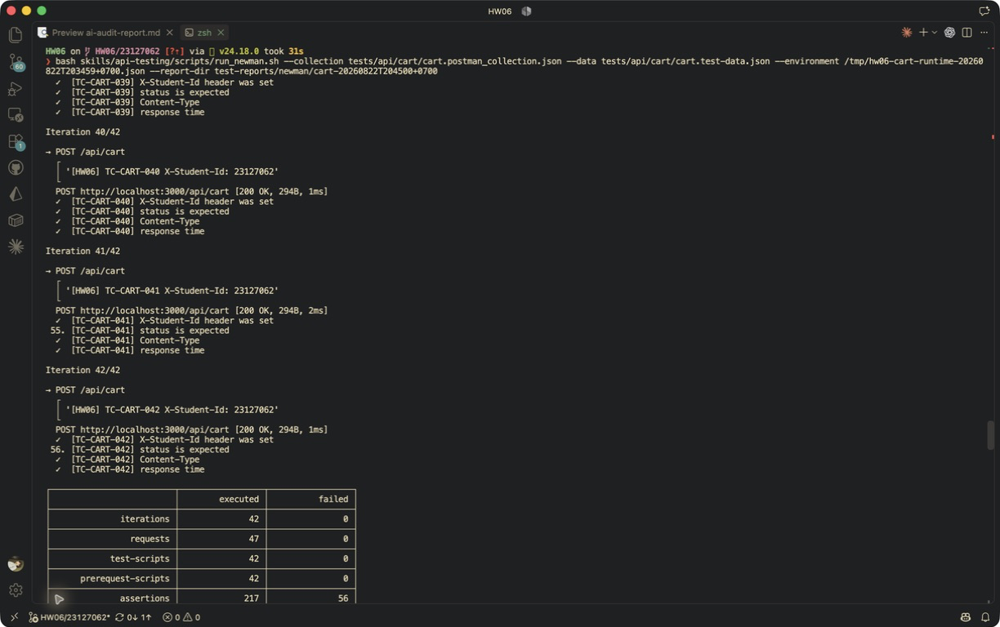

# [BUG][Shopping Cart API] POST /api/cart chấp nhận non-JSON Content-Type và lưu null

## Found by Test Case
TC-CART-041

## Also detected by
- TC-CART-042

## Requirement liên quan
API specification `POST /api/cart`: request dùng Body JSON; schema/content-type validation và safe input handling.

## Severity / Priority
Major / P1

## Environment
- Base URL: `http://localhost:3000`
- Endpoint: `POST /api/cart`
- Commit/build: `4fce82f5c3730a305e4c1e9838b77424bb9a8897`
- Executed at: `2026-08-22T20:45:00+07:00` (Asia/Ho_Chi_Minh)
- Student ID header: `23127062`

## Steps to reproduce
1. Đăng nhập user và lấy JWT hợp lệ.
2. Gửi `POST /api/cart` với `Content-Type: text/plain` và body JSON-looking.
3. Gọi `GET /api/cart` bằng cùng JWT.

## Expected result
API từ chối request bằng controlled HTTP 400/415/422 và không thay đổi giỏ.

## Actual result
API trả HTTP 200 với `{"message":"Added to cart"}`; chiều dài giỏ tăng 1 và phần tử mới là `null`. Request thiếu Content-Type cũng trả HTTP 200.

## Evidence
- Screenshot: 
- Raw response/log: [content-type evidence](../../test-reports/evidence/cart/content-type-confusion/response-or-log.txt)
- Newman report: [HTML](../../test-reports/newman/cart-20260822T204500+0700/newman-report.html)

## Reproducibility
2/2 minimal attempts với `text/plain`, ngoài Newman TC-CART-041 và TC-CART-042.

## Duplicate check
- Query: `/api/cart`, `cart text/plain`, label `Module: Shopping Cart`, cả open và closed issues.
- Result: No duplicate found; published as [issue #286](https://github.com/lmchkhi/CS423-CSC15003-Testing-N08/issues/286).
