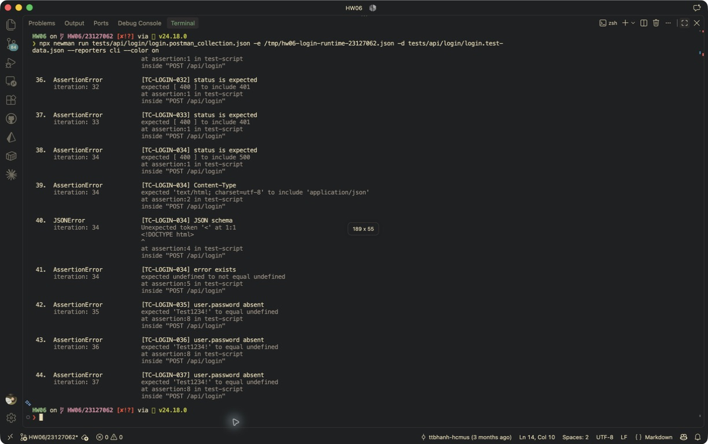

# [BUG][Login] Response đăng nhập trả plaintext password trong user object

## Found by Test Case

TC-LOGIN-001

## Also detected by

- TC-LOGIN-002
- TC-LOGIN-027
- TC-LOGIN-035
- TC-LOGIN-036
- TC-LOGIN-037

## Requirement liên quan

SEC-01 — Mật khẩu không được lưu hoặc trả về dưới dạng plaintext.

## Severity / Priority

Critical / P0

## Environment

- Base URL: http://localhost:3000
- Endpoint: `POST /api/login`
- SUT code commit: `85af3ba875c88283615e22cb108f13e2fccaf0e9`
- Git HEAD lúc chạy: `7b86a4a3ac972584de1e725e5b2a2464b7d4d7ef` (working tree có thay đổi chưa commit)
- Executed at: `2026-08-22T13:07:51+07:00`
- Student ID header: `23127062`

## Steps to reproduce

1. Gửi request login với một tài khoản hợp lệ và `Content-Type: application/json`.
2. Quan sát HTTP 200 và object `user` trong response.
3. Kiểm tra sự tồn tại của field `user.password`.

## Expected result

Response có JWT token và thông tin user nhưng không chứa plaintext password hoặc field nhạy cảm tương đương.

## Actual result

HTTP 200 trả object `user` có field `password`; giá trị thật đã được redaction khỏi artifacts.

## Evidence

- Raw response/log: [response-or-log.txt](../../test-reports/evidence/login/plaintext-password/response-or-log.txt)
- Newman report: [newman-report.html](../../test-reports/newman/login-20260822T130751+0700/newman-report.html)
- Screenshot:  — output Newman trong terminal VS Code, thể hiện các assertion `user.password absent` thất bại ở TC-LOGIN-035, TC-LOGIN-036 và TC-LOGIN-037.

## Reproducibility

6/6 login thành công thuộc 37 testcase còn lại làm assertion `user.password absent` thất bại; cùng triệu chứng xuất hiện ở user và admin.

## Duplicate check

- Query: `login plaintext password user.password`
- Result: Existing issue [#69](https://github.com/lmchkhi/CS423-CSC15003-Testing-N08/issues/69); không tạo issue mới.
