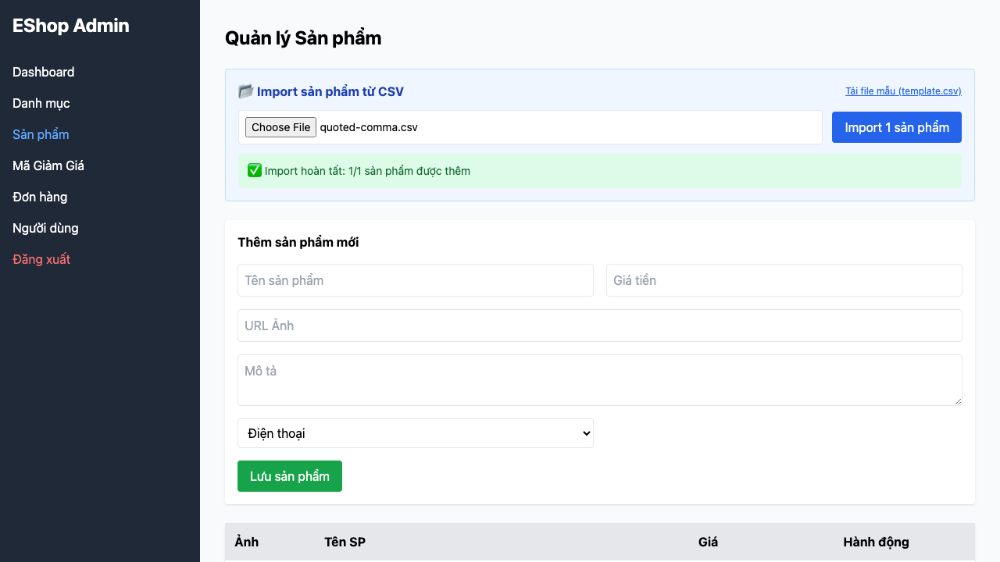

# [BUG][CSV Import] Parser làm hỏng trường được bọc nháy kép có dấu phẩy

## Found by Test Case

TC-CSV-003

## Requirement liên quan

FR-16

## Severity / Priority

Major / P1

## Environment

- Browser: Chromium, Firefox, WebKit (Playwright 1.62.1)
- OS: macOS 26.5.2
- URL: http://127.0.0.1:5174/
- Build/commit: `0a9af99e240cad01ade855346c5b89086dd4c588`
- Run timestamp: 2026-08-08T05:42:20Z

## Steps to reproduce

1. Đăng nhập Web Admin và mở tab Sản phẩm.
2. Tải CSV có description `"Mỏng, nhẹ và bền"` theo RFC 4180.
3. Bấm Import và kiểm tra preview/payload gửi tới API.

## Expected result

Description được parse nguyên vẹn thành `Mỏng, nhẹ và bền` và các cột sau không bị lệch.

## Actual result

Description trong payload chỉ là `"Mỏng`; parser tách trực tiếp theo dấu phẩy và làm lệch các cột còn lại. Lỗi tái hiện trên cả ba browser.

## Evidence

[Trace](../../artifacts/product-csv-import/chromium/product-csv-import-FR-16---f5799-g-có-dấu-phẩy-theo-RFC-4180-chromium/trace.zip)

## GitHub Issue

https://github.com/lmchkhi/CS423-CSC15003-Testing-N08/issues/31
