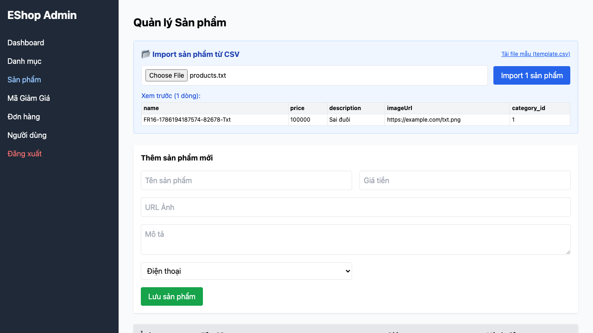

# [BUG][CSV Import] Web Admin chấp nhận file không có đuôi CSV

## Found by Test Case

TC-CSV-004

## Requirement liên quan

FR-16

## Severity / Priority

Minor / P2

## Environment

- Browser: Chromium, Firefox, WebKit (Playwright 1.62.1)
- OS: macOS 26.5.2
- URL: http://127.0.0.1:5174/
- Build/commit: `0a9af99e240cad01ade855346c5b89086dd4c588`
- Run timestamp: 2026-08-08T05:42:20Z

## Steps to reproduce

1. Đăng nhập Web Admin và mở tab Sản phẩm.
2. Chọn file `products.txt` có nội dung giống CSV.
3. Quan sát input, preview và nút Import.

## Expected result

Hệ thống từ chối file vì đuôi không phải `.csv`, không preview và không cho phép import.

## Actual result

Input giữ `products.txt`, tạo preview và cho phép gửi import. Lỗi tái hiện trên cả ba browser.

## Evidence

[Trace](../../artifacts/product-csv-import/chromium/product-csv-import-FR-16---94750-chối-file-không-có-đuôi-CSV-chromium/trace.zip)

## GitHub Issue

https://github.com/lmchkhi/CS423-CSC15003-Testing-N08/issues/24
